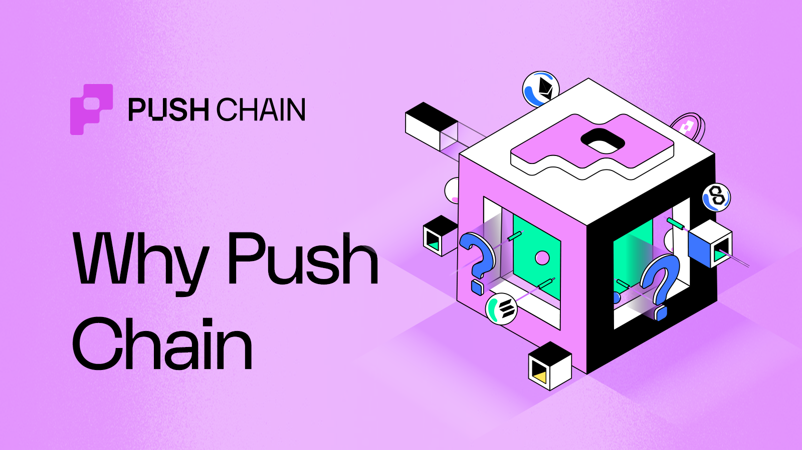
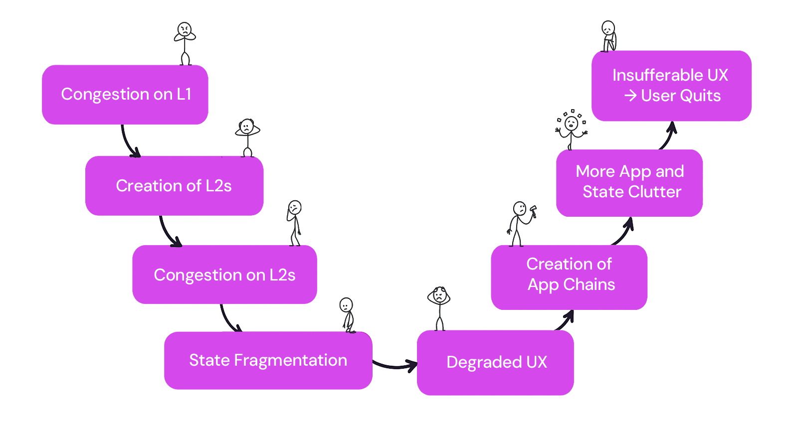
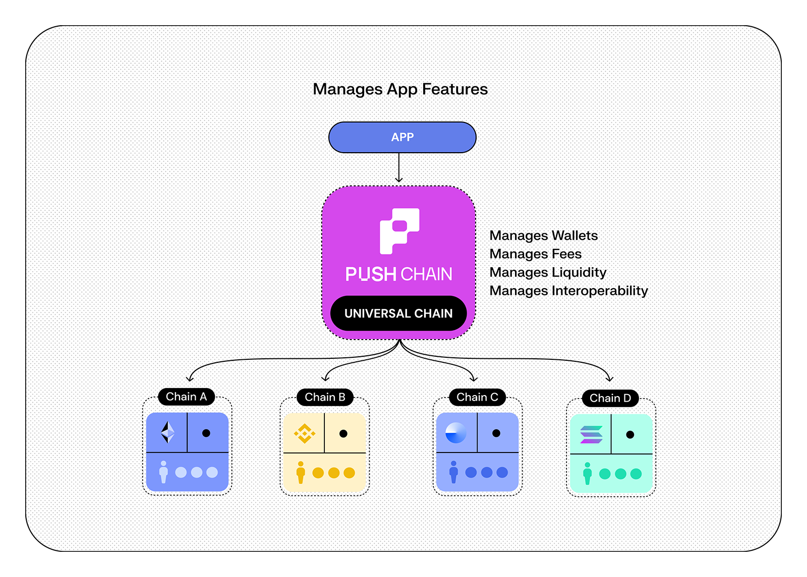
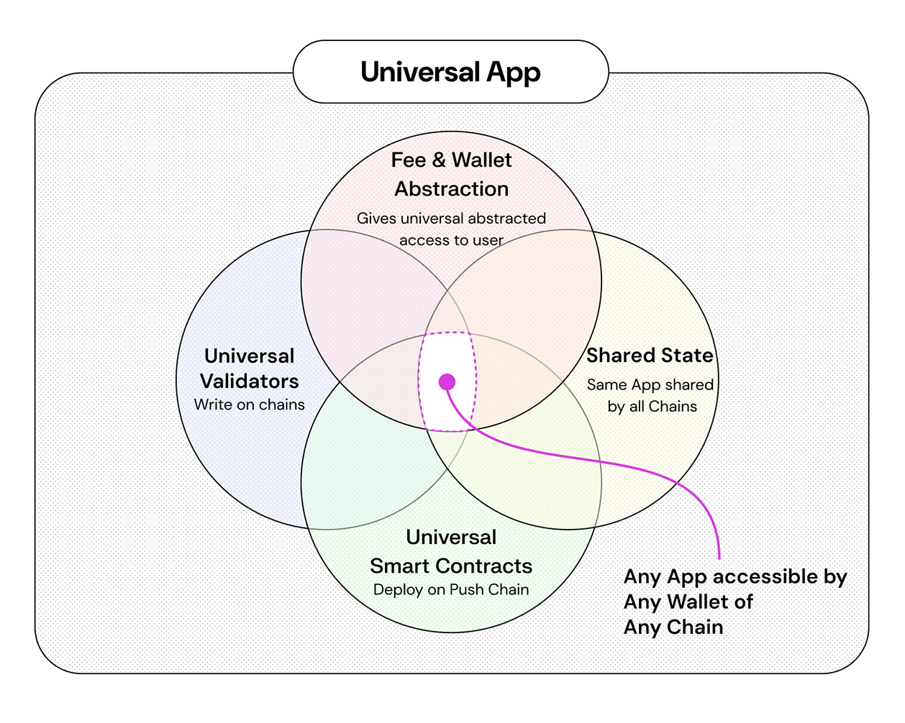

<!--truncate-->

## Introduction

Today’s web3 is fractured - users bounce across 30+ chains, while developers gamble on choosing the ‘right chain’ to find traction, only to rebuild their app again and again for every new ecosystem; All of this is leading to a fragmented experience for everyone.

This fragmentation is a major blocker towards overall web3 adoption.

In this article, we will dive deep into the concerns that exist in web3 today and the solutions that Push Chain offers for each one of them.

## The Major Concerns in Web3 Today

### Fragmentation of chains

**Out of ~617 million global crypto users, only 5-10% users actively transact 😲!**

Barriers to entry, the dilemma of choosing the right chain, and multiple points of friction in UX could reasonably be attributed as causes of the growing share of dormant users.

Vitalik in his [recent talk at Devcon](https://youtu.be/ei3tDRMjw6k?si=w1kYuzgR0ho-90Eb&t=1775) (timestamp: 29:35) emphasized the need for building both non-financial and mixed financial applications.

This vision can't be achieved if the users have the onus of learning and understanding the intricacies of each chain, the wallets, the tokens, the protocols, the bridges, etc.

The problem has further worsened with Vitalik’s conception of the _Rollup-Centric Roadmap_.

With Ethereum pivoting towards rollups as their scaling strategy - while significantly increasing **_transaction throughput_** and **_reduced transaction costs_** has led to an abundance of _L2 and L3 chains_.

For the average user, the experience of using web3 is now fragmented and the **joyous technical marvel** has turned into a **user nightmare**.

### UX Clutter

_Clutter is the Enemy of Clarity._

With each additional step spent completing an action, including switching between networks, time spent in choosing the right chain, protocol, or wallet, decreases [_Psych_ - a unit of measure for motivation to complete an action.](https://andrewchen.com/psychd-funnel-conversion/)

Here is a quick glance at what a typical web3 user needs to deal with in this multi-chain universe:

- Managing multiple wallets,
- Managing multiple native tokens/assets in their multiple wallets,
- Understanding the nuances of each network,
- Navigating multiple networks to perform simple tasks,
- Interacting with complicated dapp UIs with frequent network switching
- Navigate through inconsistent user interfaces
- Relying on the risky route of cross-chain bridging between chains
- Experiencing difficulty in maintaining a consistent cross-chain identity due to the multi-chain ecosystem
- Dealing with the lack of standardization between networks, protocols, etc
- Dealing with the learning curve of understanding different networks, each with its own set of rules, interfaces, and requirements.

Remember that this is just a glance at the UX problem.

There are undoubtedly more issues for a web3 user daily. The list is even longer when it comes to newbie web3 users.

### User Retention Challenges

Poor UX can directly impact user retention.

Truth be told, it already is impacting user retention.

When users encounter difficulties in navigating the web3 ecosystem, they are less likely to return to it. High-profile dApps that have struggled with user retention due to UX issues serve as cautionary tales for new projects entering the space. Complex interfaces, slow transaction times, and confusing wallet setups have all contributed to a decline in user engagement and adoption.

### Security and Trust Concerns

The complexity of managing multiple chains also introduces security risks.

Users must ensure that they are interacting with the correct chain, using the right wallet, and understanding the implications of each transaction. This complexity increases the likelihood of user errors, such as sending assets to the wrong address or falling victim to phishing attacks.

Furthermore, the process of bridging assets between these chains is quite often cumbersome and fraught with risks. Users must rely on various bridging protocols, which not only add to the complexity but also introduce potential security vulnerabilities. For instance, a user willing to move tokens from Ethereum to an L2 solution must navigate multiple steps, including wrapping and unwrapping tokens, which can be a deterrent for new users.

### Increased Complexity for Builders

Each chain often has its own development tools, SDKs, and environments that developers must learn & adapt to, which can be time-consuming and lead to inconsistencies in development practices. Maintaining applications that operate across multiple chains requires managing multiple codebases or conditional code paths. This can lead to significant maintenance overhead, especially when chains update their protocols or APIs.

Each additional chain integrated into an application introduces new potential vulnerabilities. Developers must ensure that the security of cross-chain interactions is robust, as any weakness could lead to exploits or hacks.

Furthermore, developing for a multi-chain ecosystem that still lacks adequate standardization - is costly. It requires more time and resources, as developers need to learn and implement different protocols, test on multiple platforms, and ensure compatibility across the whole environment involved. The additional cost of extensive security audits makes the process of building & maintaining apps even more difficult.

There is no one size fits all solution, nor is there a way to restrict the proliferation of chains.

**_But what if there was a way to unify every fragmented state under one shared state?_**

## What if there exists a shared state chain enabling universal apps?

While fragmented UX is definitely a concern, there are more nuances to it then you can imagine.

For instance, there are over 30 Layer 1s, 120 Layer 2s and soon thousands of Layer 3 chains. Imagine the sheer number of DApps deployed on all of these chains!

Newer chains have led to the rise of siloed environments having limited or zero awareness of each others state - even Ethereum!

The majority of these apps still operate within closed systems. Contracts pertaining to each chain store states in an isolated manner leaving little opportunity for users for a unified experience.

Siloed environments in turn add more interop complexities forcing developers to **shift price-sensitive apps** to app-sensitive infrastructure, further affecting the UX and escalating fragmentation.

We just have to look at industry leaders like Vitalik and Justin Drake and the concerns they have raised:

With such an extent of liquidity, state and UX fragmentation, it becomes troublesome for web3 apps/users to seamlessly interact with apps on multiple chains. In fact, in order to move assets or payloads between chains, a user is often exposed to the on-chain intricacies and risks to achieve simple tasks.

For instance, a use with governance token on chain A cannot vote on any proposal of the same protocol on chain B as there is no unified system to support this activity. As a result, every app on a specific chain becomes its own siloed state.

This leads to an issue where there is no unified infra for apps to be built on. And there is a shared app experience for users to just use apps without having to worry about the underlying chains, finality risks, bridging or facing complicated UX.

**This is where Push Chain comes in.**

## Enter Push Chain: A True Universal Blockchain

Push Chain is a purpose built blockchain that is designed to eliminate fragmentation across all chains and bring in the era of universal apps.

It is a shared state blockchain built to allow developers to deploy once, and instantly have their apps available for users on any chain - whether Ethereum, Solana, Bitcoin or any other Layer 1s.

Under the hood, Push chain provides a unified toolkit that enables developers to build truly universal apps. It brings in several innoations such as:

- **Any Chain Transaction** 
  Push Chain is designed to allow transactions from any chain. Users are able to interact with the apps deployed on Push Chain from any chain as they natively do on their own chain.

- **True Universal L1** 
  Push Chain natively recognizes the wallets of other chains and attributes transactions to those wallets. Your identity and signature is used to verify and interact with the apps. This enables a shared app experience for users across all chains. Never again an app experience or user will be siloed to a single chain.

- **Wallet Abstraction** 
  Wallet abstraction enables users from any existing wallet (metamask, phantom, etc) to seamlessly interact with the apps deployed on Push Chain. Any existing wallet simply works out of the box.

- **Universal Fee Abstraction** 
  Any tokens on any chain can be used to pay for the fees on Push Chain including native tokens of Ethereum, Solana, etc. Using an app no longer requires funding the wallet with native tokens of Push Chain.

- **Universal Smart Contracts** 
  Push Chain is a fully EVM compatible chain. Any EVM compatible smart contract can be deployed on Push Chain with zero on-chain code changes to instantly become compatible with all L1s (including non-EVM chains).

- **Shared State and Programmable Solvers (Roadmap)** 
  In the future, Push Chain will be able to access the state of other chains and perform any action on them, all through the smart contract.

Push Chain is a massive leap towards a unified web3. It makes every app experience truly universal and native with **zero hassle** for users or the developers.

> Push Chain enables developers to understand the user and build universal smart contracts to fulfill the user’s need irrespective of what chain(s) the user state is on which ushers countless innovations.

The feature opens up the entire web3 userbase to be available for a web3 application enabling shared app experiences no matter from what blockchain the user accesses the application.

It also makes Push Chain the **universal execution layer** for all other chains (EVM / Non-EVM).

What we are imagining is an era where a user does not use Uniswap “on Ethereum” or Uniswap “on Polygon” or Uniswap “on Arbitrum” — but rather simply **uses Uniswap** for its features.

It's an exciting time, a new era of web3 is upon us and we are ecstatic to be building the future of web3 with you all.

**LFPush 🔥🔥**
