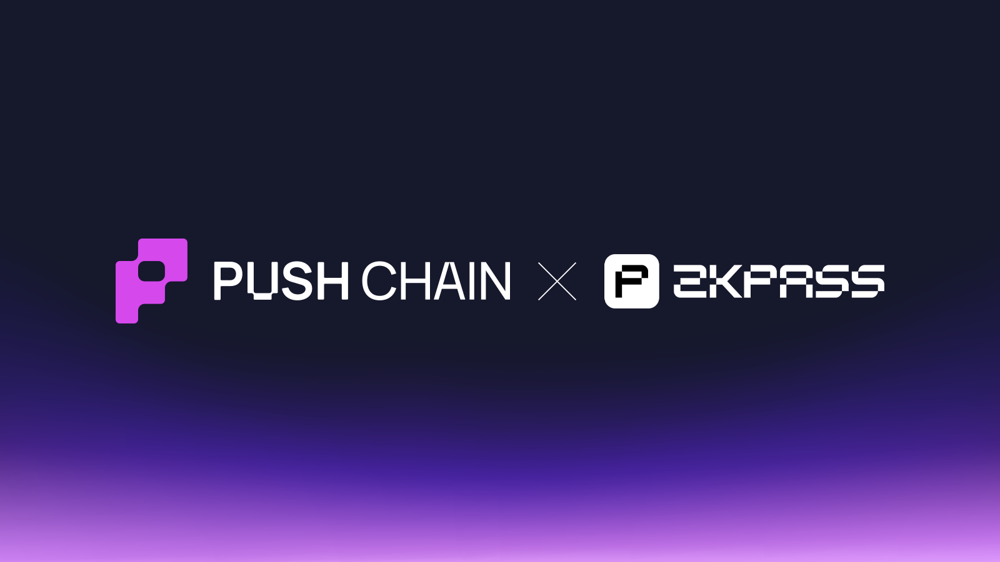

<!--truncate-->

Push chain is pumped to join forces with zkPass to transform user privacy in the new internet world.

Discover how this collaboration empowers developers and users, unlocks groundbreaking use cases, and drives the web3 ecosystem forward.

## What is zkPass?

[zkPass](https://zkpass.org/) is a privacy-first zkTLS oracle protocol that enables private internet data to be verifiable on-chain without revealing the actual information, using zero-knowledge proofs and innovative TLS architecture to ensure data verifiability, privacy and composability.

With over 4 million ZK Proofs generated, zkPass provides tools and applications for secure, verifiable data sharing with privacy and integrity assurances from any HTTPS website without requiring OAuth APIs.

## What is Push Chain?

Push Chain is a shared state blockchain for universal apps. It is a Proof of Stake (PoS) chain
built to allow developers to create universal apps and act as a shared settlement layer for multiple L1s, L2s, and L3s enabling transactions from any chain - any app and any user.

[Explore more about Push Chain here](https://push.org)

## 👥 How does this benefit zkPass and Push Chain users?

**Verify your private data on any app and any chain.**

Push Chain extends zkPass’s proving capabilities by enabling verification support for any EVM as well as non-EVM chains like Solana, Aptos etc.

**Universal private identity**

Users can now create a truly private and unified blockchain presence through Push ID - a universal identity system that seamlessly connects all their wallets (EVM and non-EVM) into one profile.

This unified identity gains enhanced privacy through zkPass, enabling **users to prove wallet ownership, assets or any other private information across any blockchain** without revealing their actual wallet details and enabling selective disclosure of wallets while linking to any application. **One private KYC that can be instantly validated on all apps and all chains.**

## 👷‍♂️How does it benefit builders?

**Build Universally accessible privacy-centric DApps**
Push Chain enables developers to build applications that work across any blockchain, while zkPass adds powerful privacy-preservation capabilities to this universal reach. Developers can use the [Push Chain](https://github.com/pushchain/push-chain-sdk) and [Transgate](https://zkpass.gitbook.io/zkpass/developer-guides/extension-js-sdk) SDKs to create apps that verify user credentials, assets, or achievements across chains without managing complex privacy infrastructure or dealing with multiple chain-specific identity systems.

**Build privately - verifiable DeFi Protocols**

Build more sophisticated DeFi applications that can access verified user credentials while respecting privacy.

Through Push Chain's shared state and zkPass's verification system, protocols can validate credit scores, collateral, and transaction history across chains without exposing sensitive user data enabling better risk assessment and more efficient capital allocation while maintaining user privacy.

## 🔓 What usecases does the collab unlock?

In addition to the unified KYC and universal privacy-focused DeFi applications discussed above, the collaboration between Push Chain and zkPass unlocks the following use cases:

**Universal Private RWA Hub**
RWA marketplaces like [Kanza Finance](https://canza.io/) can leverage Push Chain and zkPass to enable instant cross-chain RWA operations with built-in compliance verification, all while keeping sensitive user data private and secure.

**Unified AI marketplaces**

AI & Privacy centric chains like [Polyhedra EXP](https://www.polyhedra.network/) can host AI data marketplaces for using zkPass, users can privately contribute data to AI models while: Proving data authenticity without exposure and receiving rewards tied to any chain.

Users can optimise their on-chain data collection process by using Push Chain’s unified shared settlement layer.

**Universal launchpads.**

Cross chain launchpads like [Pools Finance](https://www.poolz.finance/) can leverage Push Chain and zkPass to power - universal DApp launchpads where Developers can utilize Push Chain’s Universal Shared State and Parallel txn processing to deploy dApps once and instantly reach users across all or any specified networks while maintaining privacy preservation, credential verification and compliance through zkPass.

## **🌌** What does this mean for Web3?

**Unifying experiences by bringing users together.**

Push Chain isn’t here to replace networks or compete with any; instead, it aims to eliminate the fragmented state of Web3 by unifying settlement across all chains under one universal shared state, unlocking a seamless, interconnected Web3 experience.

## Next Steps

1. Follow [@PushChain](https://x.com/PushChain) on X to get the latest updates about Push Chain
2. Check out the [Push Chain Whitepaper](https://whitepaper.push.org/) for a detailed overview of the vision and the underlying technicalities.
3. Visit the [Push Chain Website](https://push.org/chain) to find a one-pager explanation of the vision.
4. [Push Chain Devnet](https://scan.push.org/) is running live on Proof-of-Stake network validators, storage and archival nodes. The network already supports consumer transactions as well.
5. [Push Chain Simulate Tx](https://simulate.push.org/) already provides a way for everyone to send tx from any chain using wallet abstraction.
6. For more questions join [Push Discord](https://discord.com/invite/pushprotocol). Our team would be glad to help you!
