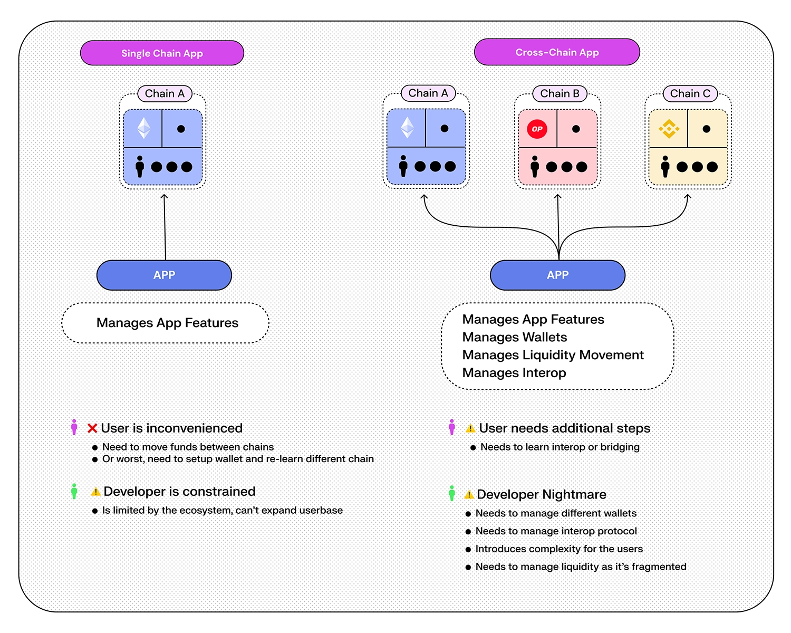
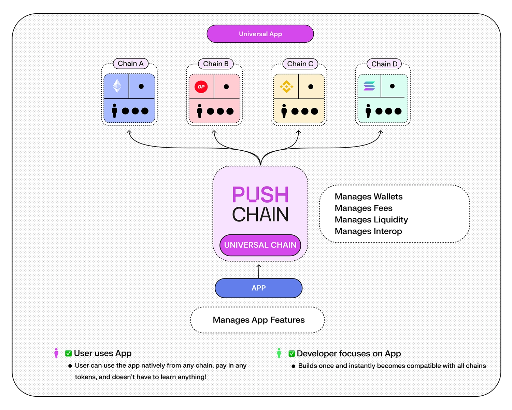
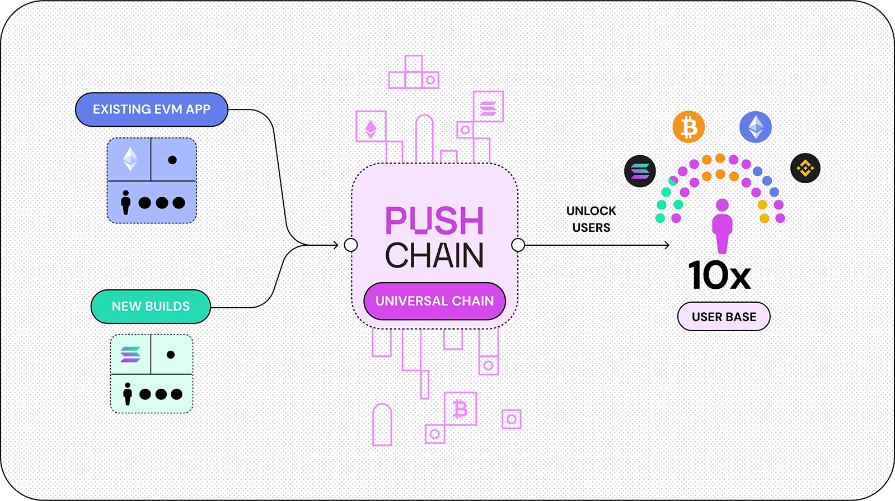

<!--truncate-->

import ReactPlayer from 'react-player';

Another L1?.... Ahh, sh\*t, here we go again.

"_Aren't there too many blockchains already? Adding more only makes it harder for apps and protocols to work across them._"

This is one of the most common questions we get asked during conferences.

If that's what you're thinking, you're not wrong - Yes, Push Chain is another L1 - except it's **NOT JUST** _'another L1'_ !!

Let's find out how..

## Don't we have enough L1s, L2s already?

Yes, crypto has tens of layer 1s, hundreds of layer 2s, and - who knows - maybe thousands of layer 3s in the near future!  
But what it didn't have was a means to unify all of these amazing chains together - and that's exactly what Push chain does.

**Push is not just another silo** - it's a universal chain that unites every existing and forthcoming chain together (under one roof). It is a shared-state L1 blockchain designed to function as a universal settlement layer for users across any chain, wallet, and app.

Combining this with its innovation of shared state, universal smart contracts, generalized programmable solver, and complete user abstraction, what you get is a blockchain able to read any other chain and… is accessible by users from any chain.

**Push Chain's vision is not to compete and replace any blockchain, but unite every chain together to maximize UX, freedom of movement, and revenue scaling opportunities for apps.**

## Is Push Chain just about cross-chain apps? Aren't there already many cross-chain protocols?

No – cross-chain apps still require deployment of separate contracts on separate supported chains. Such apps typically rely on bridges and manual relayers to move tokens and messages between chains, leading to separate liquidity formation and additional development overhead.

Push Chain introduces Universal Apps that can:

- **Be accessed by users of any chain**– Devs can write and deploy a single contract on Push Chain that interacts with multiple blockchains without deploying separate contracts on each chain.

  This is the magic of the **Shared Execution Layer.**

- **Read and sync live states from multiple chains**, including token balances, contract data, and user activity.

**Cross-chain apps move assets. Universal apps built on Push Chain move logic and context along with assets**. Thus, opening the doors to a wide variety of use cases that once were deemed impossible - discover these cool use cases here - [Vol. 1](/blog/apps-only-possible-with-shared-state-v1/) and [Vol. 2](/blog/apps-only-possible-with-shared-state-v2/).

_Want to build a universal app? Or make your existing Dapp universal?_  
_Check out [Push Chain Docs](/docs)._

## Is Push Chain EVM compatible? SVM compatible? Or Move compatible?

Push Chain is 100% EVM compatible & at the same time, it's also **universally compatible.**

Meaning:

- Everything that EVM chains support -> Push Chain supports. 
  Therefore, EVM devs don't have to endure any new learning curve. At the same time, on deploying your evm contracts on Push Chain, your EVM dapps become automatically compatible to users from any other EVM ecosystems like Solana or BSC.

- Everything deployed on Push Chain is automatically compatible with EVM, or non-EVM chains.
  This means, that any deployed apps on Push Chain is universally compatible and can be accessed by users from any other chain.

Devs can either:

1. **Deploy their existing app to Push Chain** (within minutes) and accept user traffic from any other chain.

2. **Build native apps** on Push Chain that are universally accessible by users from every chain and VM.

_An Ethereum user and a Solana user can compete, collaborate, or transact within the same app because_ → _this is a truly universal Layer 1._

## How is Push Chain different from existing interoperability solutions?

Majority of cross-chain apps today rely on interoperability solutions that provide bridges and arbitrary message passing

- Bridges move tokens across chains → Effective yet slow, costly, and filled with multiple friction points.

- Message protocols (like Axelar, LayerZero) pass arbitrary messages → useful, but they don't give apps a coherent view of user state across chains.

Push Chain utilizes a different approach with the help of:

**1. Universal Smart Contracts**  
Devs deploy one contract that is instantly compatible across all chains. It is 100% EVM compatible and required **zero on-chain code changes**.

**2. Shared State** 
An innovation by Push Chain where smart contracts can read and use states from other chains.

Using shared state, apps on Push Chain can easily query verified state from any supported chain (token balances, contract state, user activity).

**3. Programmable Solvers** 
Provides paths to execute any multichain action - enabling apps to act across chains without forcing users to bridge or switch networks.

This is what we call the **Fullstack universal interop** → Universal Wallet + Generalized Programmable Solvers + Shared State + Universal Smart Contracts.

## Why build on Push Chain?

_If you're building on one chain, deploying on Push Chain helps you reach users across all blockchains – without rewriting your app, switching wallets, or begging users to bridge._

Building on Push Chain automatically means you…

### 1. Expand user base & Drive app sustainability

By enabling apps that can host users from any chain, and not just the chain on which the app is primarily based on. **Guaranteeing higher user traction -> higher revenue generation -> and wider distribution**

And that too with super limited development overhead!

### 2. No extra smart contract audits required

Since Push Chain is fully EVM-compatible, you don't need to rewrite or modify your existing contracts.

This also means you can deploy them without needing an additional audit – saving time and effort. Just plug in your audited EVM contracts, integrate the Push Chain UI wrapper, and you're good to go!

Cherry on the top -> Your App now automatically gains access to Solana, BNB and other EVM users

_Push Chain will soon, also support all other L1 chains (be it Move-based or any other VM)_

### 3. It's Alright if users don't have a wallet\

Web2 native users or users with no active wallets can always interact with apps deployed on Push Chain - because of its inbuilt wallet abstraction support.

Any user can :  
 -> Login using their web2 socials (email, google account) OR  
 -> Existing wallets (Phantom, Metamask, Rabbi etc)

**Note**: As we unlock support to more Layer 1s - you'll only be required to upgrade the package of the wallet abstraction frontend component. No more complex chain integration nightmares ;)

### 4. It's alright if users don't have native chain tokens for gas\*\*

With the support of Fee Abstraction -

- You can use any token that you have - to fund the fees. Similar with Ethereum and other chains.
- Push eliminates the need for bridging for fees, manual management of funds on multiple chains and introduction of unnecessary learning for the average user.

### 5. Unfragment User Experience, liquidity, and user retention

Rise of Layer 2s and chains solved a lot of pressing challenges but also led us to a series of cascading shortfalls, leading to deterioration in user as well as developer experience.

Building on Push Chain solves these challenges to a greater extent with fast and reliable movement of data and assets between chains (for both apps and users).

The user can remain on the chain where they are and either utilise fee abstraction or universal wallet (most of the time both) to interact with other chain.

## Conclusion

Finally, this concludes our trip – from perceiving Push Chain as just another L1, to recognizing it as the Universal Layer 1.

The points covered in this article answer some of the most common questions we get asked, **TLDR;**

We're enabling Apps that are capable of:

- Unifying liquidity
- Unifying cross-chain user bases
- And most importantly – unifying our shared love for this space!

If you want to make your app truly flexible and accessible from every chain - join our [Discord](https://discord.com/invite/pushchain) today! Or dive straight into the [Developer Docs](/docs) to get started.

& finally…

_Yeahhh it's Push Chain… here we go!_

<ReactPlayer
  controls
  width="100%"
  url="https://www.youtube.com/watch?v=vCadcBR95oU"
/>
