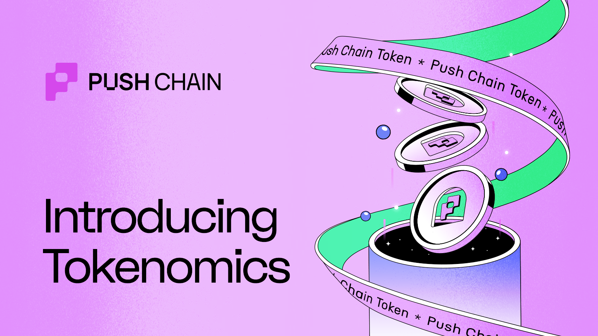
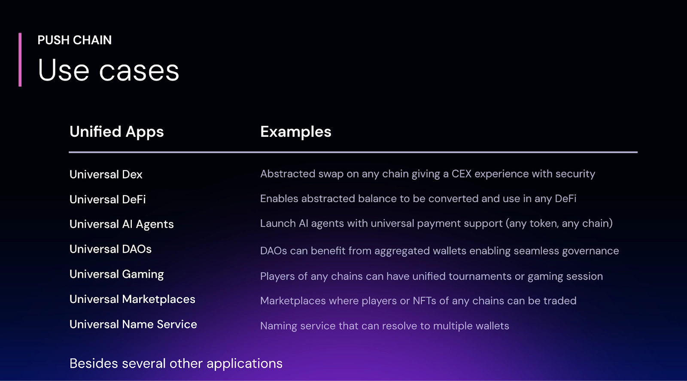
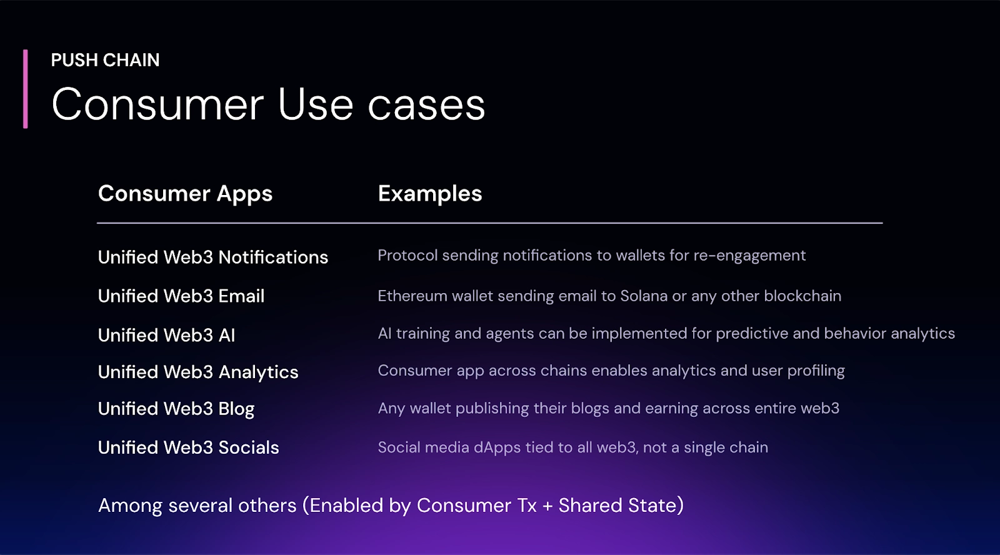
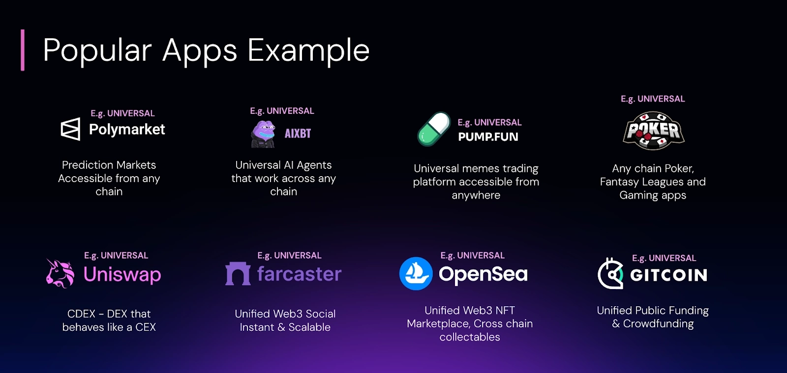
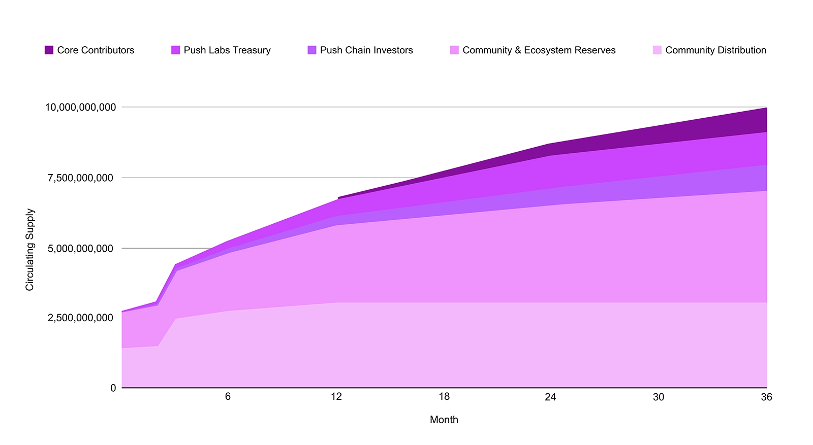

<!--truncate-->

:::warning

This article is moved to it's own dedicated page. Please refer to the [Push Chain's Tokenomics Page](/knowledge/tokenomics) for latest information.

:::

## Overview

In late 2024, the Push community voted to approve the launch of Push Chain, a shared state layer 1 blockchain designed to enable the development and scale of universal applications.

Push Chain is a purpose-built layer that connects L1s, L2s, and L3s with near-instant finality and true scalability, which solves the fundamental issue with web3 applications: fragmentation. With the successful voting of the governance proposal, the Push Chain mission is now on its way toward building **any chain, any user, and any app.**

:::caution
The Push Chain token is not live, nor is any presale live. The Push Chain token is not yet named. The migration from Push Protocol $PUSH to the Push Chain token is not live.

Do not believe anyone offering early access or early migration to the Push Chain token. All communications regarding Push Chain will be announced simultaneously from official Push channels — [Twitter / X](https://x.com/PushChain 'X handle of Push Chain'), [Discord](https://discord.com/invite/pushchain 'Discord of Push Chain'), [Telegram](https://t.me/epnsproject 'Telegram of Push Chain'), [Website](https://push.org 'Push Website').
:::
&nbsp;

## What is the Vision of Push Chain?

All blockchains have proven particularly useful for specific apps and use cases. Bitcoin enabled smart money. Ethereum enabled innovations for DeFi. Solana enabled fast apps and meme culture. Several L2s and new L1s are targeting other areas of concern.

However, a blockchain that is purpose-built to enable chain abstraction and seamless interoperability in the space is still required. This chain would enable transactions from any chain (ETH, SOL, EVM or non-EVM) to power apps that can be used by **any user —** no matter their chain or wallet. This is the chain of **Universal Apps**. This is Push Chain\!

### Built on innovation to eliminate blockchain isolation!

Push Chain is revolutionary for both users and developers as it creates an environment for any developer to deploy their universal app in hours via a single universal smart contract deployment.

It also enables users to transact from the comfort, convenience, and choice of their ecosystem, no matter where the app resides.

Under the hood, this is achieved by:

- Ability to do **transactions from any chain**
- **Fee & Wallet Abstraction** (universal wallet \+ guest wallet)
- **Shared State** (read data from other blockchain) 👀
- **Generalised Programmable Solve**r (enables acting on the data read from other chains)
- **Universal Smart Contract** (enables devs to deploy universal interop apps in hours)
- **Shared App Experience** (any user from any chain can access any app of any chain)

:::info
**Full Stack Interop (Universal Apps)** \= Universal Wallet \+ Generalized Programmable Solvers \+ Shared State \+ Universal Smart Contracts
:::

### Where does Push Chain fit in?

Push chain fits **every project…** **on every chain\!**

\- **It allows developers** from any chain to create seamless full interop apps that can be used from any chain, via any wallet. 
\- **It allows users** the freedom to interact with the wallet of their choice or have a seamless signless experience via Push Universal Wallet with social login. 
\- **It allows shared app experiences** where users of all chains can come together and engage with Omni DeFi, Omni gaming, Omni NFT, Omni Governance, etc. 

### What can be built on Push Chain?

Push Chain brings seamless interoperability and unifies all L1s, L2s, & L3s and therefore is poised to become the playground of innovation and interop. You can build existing web3 use cases such as:

Or you can better web3 and create innovations:

Or you can see some popular app examples and to take inspiration from:

## 👋 Push Chain Tokenomics

### Token Utility and Functionality

In the proposal, the Push Chain token is designed with multiple utilities that support the network's operation and growth.

1. **Network Security**: The token powers Push Chain’s Proof-of-Stake consensus mechanism through staking and slashing, ensuring the security and reliability of the network.
2. **Transaction Fees**: The token serves as the primary method for network fees for transactions and app usage.
3. **Governance**: Token holders gain voting rights to propose and decide on protocol changes, actively contributing to the chain’s future.
4. **Fee Abstraction**: Push’s Fee+Solver contract is used to enable users of any chain (whether ETH, SOL), etc to pay for gas via native token. A portion of the fee collected will be swapped and burned for Push Chain native token.
5. **Incentives**: The token supports an ecosystem of rewards for validators, users, and community members through fee sharing and a reward system.

Push Chain adopts a dynamic supply model, which is used among popular chains (like Ethereum and Solana). Post mainnet, new tokens for the chain would be mined solely for node rewards, relayer rewards, and other participants that are required for ensuring chain security, functionality, and decentralization needs.

### Burn and Deflationary Mechanism

Push Chain has a couple of burn mechanisms owing to it being a Universal Blockchain.

1. **Native Chain Burn**: A part of the fees is always burned when native transactions are done on Push Chain.
2. **Cross Chain Burn**: Using Fee Abstractions, a part of the fee collected on other blockchain’s native token (ETH, SOL) is swapped for Push Chain native token and burned.

This ensures a deflationary blockchain design that burns tokens as the network and the transactions that happen on it grow. This allows the chain to achieve deflationary tokenomics design while still awarding the validators and other actors. This design enables the creation of an incentivized, sustainable long-term future for Push Chain and all its participants.

### Migration Details

Push Chain is the result of years of learning from building the leading notification and communication protocol of web3, which was one of the first consumer apps for crypto.

Owing to this, apart from the airdrop allocated (see details below) to Push Chain users, creators, developers and ecosystem partners, **there is also a migration drop reserved for the $PUSH holders** (which was the native token of Push Protocol).

**For existing $PUSH token holders**, the Push Chain tokenomics proposal allocates 15% of the total Push Chain token supply specifically for migration. The migration will occur at a ratio of **1:15**—meaning for each Push Protocol ($PUSH) token you hold, you'll receive 15 Push Chain tokens. For example, if you currently hold 40 $PUSH tokens, you'll receive 600 Push Chain tokens after migration.

The launch of Push Chain is designed to reward and incentivize prior Push Protocol ($PUSH) holders for their loyalty and contribution. The migration process for existing $PUSH token holders will work as follows:

- Tokens will migrate at a 1:15 ratio (1 Push Protocol token \= 15 Push Chain tokens).
- Participants in the Push Chain migration will see 50% of their migrated tokens unlocked immediately, and an additional 50% unlocked after 3 months.
- Token migrators will also benefit from a dedicated yield farming pool reserved for them. These rewards will be distributed to token migrators if they stake their migrated Push Chain tokens, to reward them for long-term contribution to the ecosystem.
- For example, if you have 100 Push Protocol $PUSH tokens, you’ll receive 750 Push Chain tokens when you migrate and 750 Push Chain tokens after 3 months — for a total of 1,500 Push Chain tokens. You can choose to stake these tokens to get additional rewards from the Push Chain yield farming pool, distributed periodically.

The Push Chain token migration will be open for 12 months after launch, after which any remaining tokens will go to the community and ecosystem reserve.

### Airdrop Details

Additionally, the tokenomics proposal allocates 10% of the total Push Chain token supply for airdrops to past and present Push Protocol application users (notifications, messaging, chat). Along with new users, creators, developers, and ecosystem partners of Push Chain.

## Token Distribution Details

The total supply of Push Chain tokens is proposed at **10 billion**, distributed as follows:

1. Push Protocol $PUSH migrators have 50% of migrated tokens unlocked at TGE, followed by the remaining 50% after 3 months.
2. Airdrop distributions begin at TGE, but will happen over the course of multiple seasons.
3. Core Contributors have a 12-month delay, followed by 24-month vesting.
4. Push Labs Treasury has a 36-month vesting.
5. Investors have 24-month linear vesting.
6. Community and Ecosystem Reserves has a 13.5% unlock at TGE, followed by 36-month vesting.
