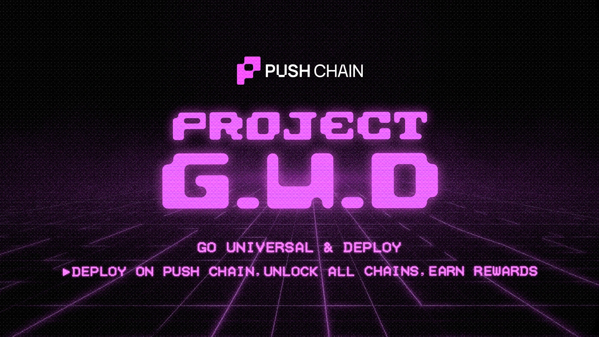
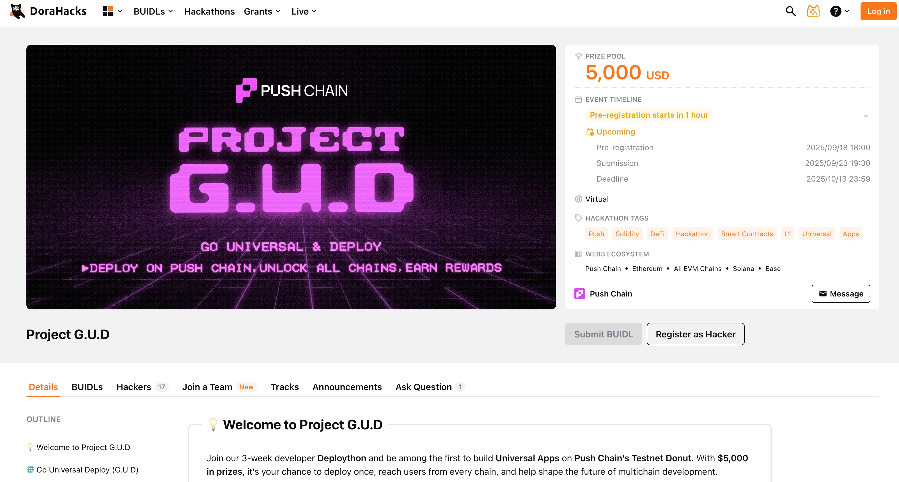

<!--truncate-->

We’re excited to announce **Project G.U.D**, a 3-week-long **Deploython** where developers can port their EVM apps to Push Chain’s **Testnet Donut**, make them Universal, and compete for **$5,000 in prizes**!

👉 We just upgraded our developer chat - [join here](https://t.me/+HBr_tyPvACFhM2Vl) to learn more.

## 🌐 What is Push Chain?

[Push Chain](https://push.org?utm_source=blog&utm_medium=referral&utm_campaign=project_gud) is a **shared-state Layer 1 blockchain** built to eliminate fragmentation across all chains.

With Push, you can build **Universal Apps** that support transactions from any chain (Ethereum, Solana, EVM or non-EVM) without forcing users to juggle wallets, tokens, or gas mechanics.

In short: **Deploy once, go cross-chain & 10X your user base.**

## 💡 Why Should You Care?

Devs deserve better for their apps - **more users, more revenue, more distribution.**

Here’s why building on Push Chain gives you a real edge:

- **Expand Your User base Instantly**: Deploy once, reach users across EVM + non-EVM chains (yes, even Solana).
- **Avoid Audit Friction**: Since you do not modify your solidity code, there is no need for a full re-audit.
- **Simplified Fees**: Automatically routes gas fees under the hood. Users do not need to hold $PC tokens or switch chains to complete transactions.
- **Consistent DevEx**: One **Push SDK**, one set of JSON-RPC endpoints, and a unified API to build and deploy. Supports Viem, ethers, and our own Push Chain client.
- **Future-Proof Builds**: With chain-native interop, your builds are future-proof as additional chains support are just a package update instead of the current broken interop protocol route.

👉 *Note: Push Chain SDK is only accessible to contest participants.* [Register](https://dorahacks.io/hackathon/pushchain-gud?utm_source=blog&utm_medium=referral&utm_campaign=project_gud) to unlock SDK + docs.

## 🏆 Rewards & Incentives

### 💰 $4000 Reward Pool + $1000 Additional through community voting (Stables)

### 😎 Jury Rewards:
| Rank       | Prize (USD) |
|--------------|-------------|
| 🥇 First Place  | $2000       |
| 🥈 Second Place | $1000       |
| 🥉 Third Place  | $600        |
| ⛳️ Fourth Place | $400        |

### 🗳 Community Voting Rewards:
Once the public testnet is live, users will crown their favorites. Top community picks win:

(*Voting will be sybil-resistant for fair outcomes.*)

| Rank       | Prize (USD) |
|--------------|-------------|
| 🥇 First Place | $500 |
| 🥈 Second Place| $300 |
| 🥉 Third Place  | $200 |

**Evaluation Criteria:**

- Functionality
- Composability
- Ease of use
- Innovation
- Design and Vibes

### ✨ Additional Perks

Apps that show long-term conviction - benefit from more support and recognition:

- Winning apps will be featured on the **Push Testnet Portal (Incentivized Season 3)**.
- **Onchain** perks (Secret passes, Badges) and **Offchain** perks (Meet the founders, 1-1 Mentorship)
- Winners gain a chance to **access Push Chains VC and partner network**.

---

## 👩‍💻 Who Should Apply? What Can You Build?

This contest is open to **all developers**, whether you’re shipping production-grade EVM apps, experimenting with new universal use case, or just curious about universal apps.

- Hack solo or form a team.
- Deploy an existing EVM app or build from scratch.

A universal app doesn't have to start from scratch. Your submissions can be:

| Deploy Your Existing EVM App | Build a New Universal App |
| --- | --- |
| No contract rewrites - deploy & instantly reach all chains. | Start fresh and explore bold new ideas that could scale into profitable startups. |

<!--Need inspiration? Check out our **[Universal Apps Idea Bucket].**-->

---
## 📋 How to Participate

1. [**Register on Dorahacks**](https://dorahacks.io/hackathon/pushchain-gud?utm_source=blog&utm_medium=referral&utm_campaign=project_gud). Fill-in basic details and share your build ideas.
2. **Join the [Donut Early Access TG Chat](https://t.me/+HBr_tyPvACFhM2Vl)** for support + mentoring.
3. **Find Teammates** or hack solo via [Push X Community](https://x.com/i/communities/1957696067207651630)
4. **Build Build Build!** 🚀

---

## 🔑 3 Tips for a Strong Submission

1. **Build in Public**: Share your progress publicly — the more the community sees, the better your chances of winning votes..  
      a. ***What can you share in public?***
      Could be as simple as your project ideas, daily/ weekly progress, sneak peaks or early glimpses.
2. **Submit Complete Projects**: Include repo + demo links. Incomplete apps get downgraded. Read the [**submission guidelines**](https://dorahacks.io/hackathon/pushchain-gud?utm_source=blog&utm_medium=referral&utm_campaign=project_gud)
3. **Don’t Wait to Register**: We highly **encourage builders to apply early**. Early registrations give you more time to connect with mentors, judges, and the community.

[Register as a hacker](https://dorahacks.io/hackathon/pushchain-gud?utm_source=blog&utm_medium=referral&utm_campaign=project_gud) with your basic details and not wait until you’re project is prepared. Open Registrations are limited.

---

## 📚 Resources & Support

We’ve got you covered with everything you need to build, deploy and shine during Project G.U.D:

<!--- **Developer Documentation** → [Register to Access](https://dorahacks.io/hackathon/pushchain-gud?utm_source=blog&utm_medium=referral&utm_campaign=project_gud)-->
<!--- **Universal Apps Idea Bucket** → App ideas-->
- **Mentorship & Guidance** → [Join Closed Beta TG Chat](https://t.me/+HBr_tyPvACFhM2Vl)
- **Community Support** → [Push X Community](https://x.com/i/communities/1957696067207651630)

👉 Register early to unlock all resources and maximize your build time!

---

## ⏰ Timeline & Closing

👉 Project G.U.D runs for **3 weeks** and ends on **Oct 13**

👉 Time to **Go Universal & Deploy**: [**Register Now**](https://dorahacks.io/hackathon/pushchain-gud?utm_source=blog&utm_medium=referral&utm_campaign=project_gud)

**May the best build win!**
