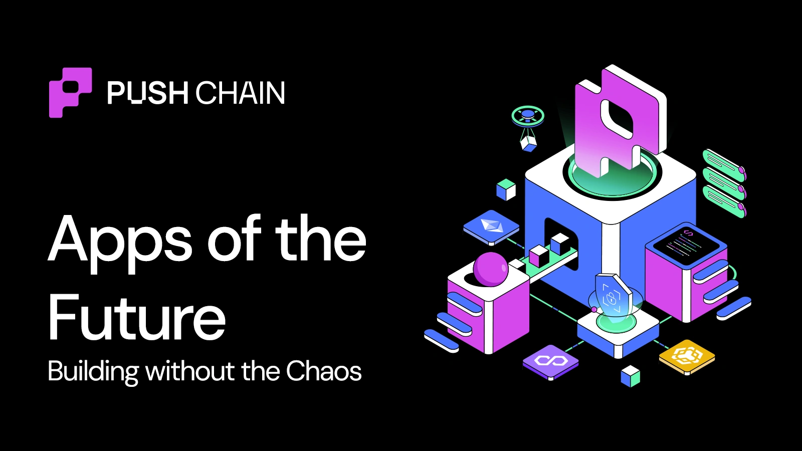
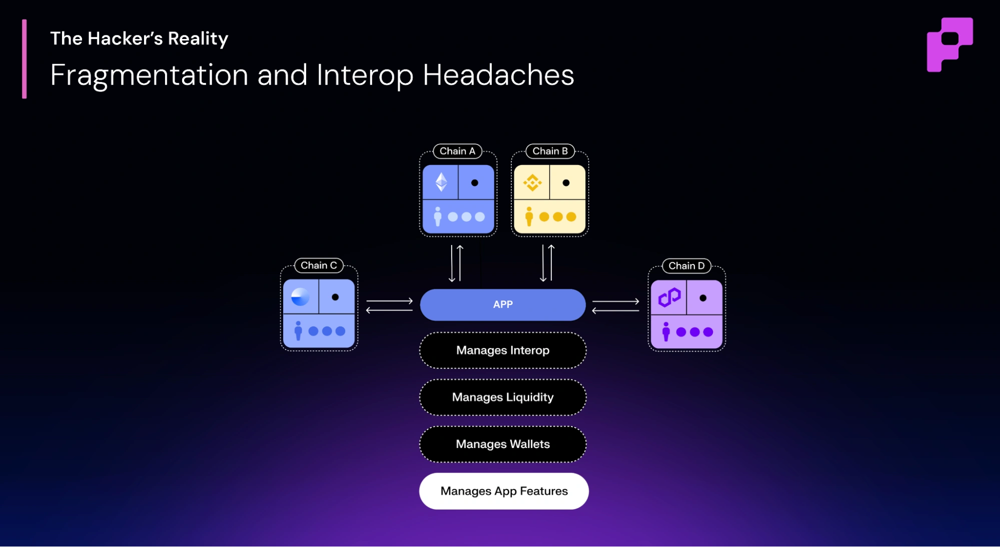
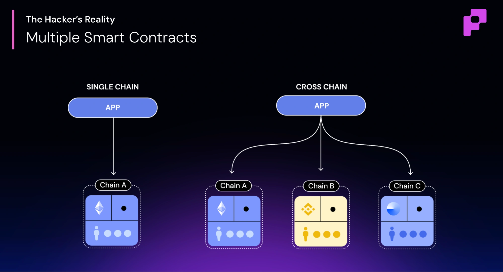
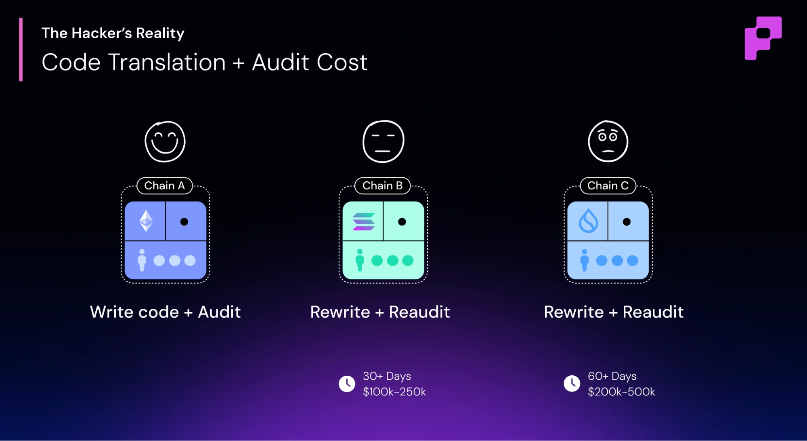
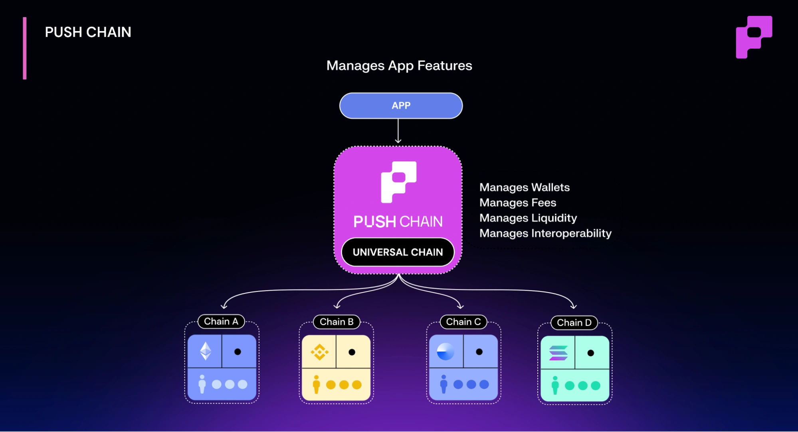
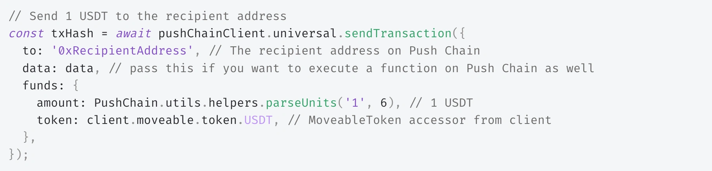

<!--truncate-->

Crypto has matured. The next generation of apps need to compete and build with finesse.
It’s no longer acceptable to have an app that only works if the user is a web3 expert. Yet time and again, we see the same pattern repeat:
We start by building apps around great features but soon… those features become secondary to survival.
Instead of focusing on what made them popular, apps end up wrestling with infrastructure, juggling bridge protocols, and rewriting logic for every new chain.

The dream of “expanding” turns into the nightmare of maintenance.
- #### Every app starts with a vision. Every interop patch starts with regret.
- #### Apps died not because users left → but because infra took over.

We’ve seen this play out a thousand times. So we asked ourselves, what if interop wasn’t something apps had to build…
but something the chain itself handled? That’s how <b>Push Chain</b> reimagines interoperability… but something the chain itself handled?
#### We stopped solving interop <i>above</i> the chain.
#### Instead we solved it <i>inside</i> the chain.
#### Because the future of apps isn’t about managing chaos — it’s about removing it.

## The Hidden Cost of “Just Make It Work”
-  Expanding beyond one chain should feel like growth, not grief.

But in web3 today, <b>the moment you go cross-chain, you trade innovation for exhaustion.</b>
Each decision; to bridge, to redeploy, to patch adds friction that compounds across teams, audits, and user experiences.

- #### That’s where the hidden cost begins. The moment when “just make it work” becomes your full-time job.

- #### By the time the app does work across chains, it’s no longer fun to build… or delightful to use.

This isn’t a problem of bad code. It’s a problem of <b>architecture.</b>

Interop today forces developers to rebuild their app again and again for every chain, wallet, and fee system, turning builders into network engineers instead of creators.

Let’s look at the hacker’s current reality, and what needs to change so no one goes through these nightmares again.

### 1️⃣ Infrastructure Eats Creativity

Every developer dreams of focusing on features. Yet, most spend 70% of their time patching infra across chains.

With the current broken reality of web3, <b>every chain you add doubles your overhead.</b>

- Infra eats your week before you ship a feature.

#### Multiple Interop Protocols
Interop protocols of today support either X chain or Y chain forcing you to manage multiple interop solutions to create the feature that you have in mind for your user.

#### Endless custom state-sync logic
Your app is forced to adapt to custom state to manage the states of these interops and the fragmented smart contracts that have been deployed.

#### Constant patching across chains
Even if you make it work, you are forced to constantly patch or “hack” UX for your users. One interop solution in this current reality is difficult to handle, leave alone multiple ones.

The end result is a bloated app that has a band-aid slapped to make it work and that band-aid requires constant attention.

- Every time a dev fixes a bridge, a feature dies.

Building your app was your passion and it should be fun. In the end, you wonder how you started as an app company but are more of a devops company.

### 2️⃣ Fragmented Contracts = Fragmented Apps

Today's smart contracts are inherently chain-specific. When you deploy on 5 chains today, you don’t have one app.

#### You have 5 isolated instances that share a logo and a dream.

Every fix, every feature is now multiplied. This is not scaling, it’s cloning chaos and multiplying maintenance.

When did “deploy everywhere” start meaning “maintain forever”?

And the problem doesn’t even stop here…

### 3️⃣ Multi-VM = exponential complexity, delays & audit costs 🚧

Supporting both EVM and non-EVM chains (like Solana or Sui) usually means rewriting everything in new languages: Rust, Go, Move, etc.

The result? You are now killing your momentum as you struggle with:

- Hiring new engineers to create the same features
- Bloating your team for no additional use cases
- Introducing delays and slowing momentum as your engineers rewrite the same contracts
- Adding auditing bills that will climb faster than TVL charts

But, let’s say you are brave enough to do it once.

And then? be prepared to do it all over again once you want to add a new feature.

-  Every new VM you add isn’t just new code. it's a new risk, new audits, new delays.

And the worst part? None of this adds new value… just new overhead.

While we struggle with these horrors, your users are not getting the best treatment as well cause you have introduced for them.

### 4️⃣ The Gas Fee Dilemma

“Buy X token on Y chain to use Z app.” - The last famous word from an ex-user of web3.

Think about this, is this onboarding.. No, that’s homework.

Users need ETH for Ethereum, SOL for Solana, POL for Polygon and countless other things… just to use one cross-chain app they like.

Does it make sense 🤷‍♂️

Is this onboarding? Or is this friction on day one?

### 5️⃣ The UX Nobody Talks About 😩

Even the best apps fall apart when users face:
- Do multiple transactions just to use a feature or an action
- New wallets or learn
- Different wallet standards (EVM vs Solana addresses 🤯)
- Bridges or protocols that they have to understand

Ask yourself, are they users at this point, or have we converted them to testers?

These issues are the reason apps of web3 don’t attract users like web2.

No one wants to learn just to try a feature.

It should just work.

-  The future belongs to apps that feel like magic — not manuals.

This is not a story that you are going through. While building one of the first consumer apps of crypto, we went through these pain points and the reason we created Push Chain – The universal blockchain where developers focus on apps and users use the features.

## The Future for Apps - Universal Blockchain that natively supports every chain

#### 🧠 Let’s return to Fundamentals

We reimagined interop so that devs are able to focus their energy on what matters most, which is the app and the features of the app that got them popular.

#### Universal Smart Contracts 🌌
We created universal smart contracts that ensure the developer only writes one smart contract that once deployed is instantly compatible with every chain (even different L1s).

This is our best innovation yet and for developers it simply means:
– Write once in solidity and deploy
– Your app is instantly accessible to users + wallets on every chain
– No redeployments
– No reaudits
– No duplicated logic

All with <b>zero on-chain code changes.</b>

One deployment. Global presence. 🌐

#### Same Tooling + Push Unified SDK ⚙️
You never have to re-work the app. You simply deploy your EVM app on Push Chain and it’s good to go.

– Ethers, Viem or any of your favorite EVM tooling simply works
– The only thing you replace is the <b>sendTransaction</b> with universal transaction
– Here’s a snippet of the code that you use to now send a transaction from any chain

> Deploy once. Reach every chain. That’s the Push way.

#### Universal Fee Abstraction ⚡️
Developers don’t need to handle gas or wallet abstraction.

For gas, the user can:
– Pay in native token of their choice
– Use any other token to fund their transaction
– All of this, without leaving the chain they are on 🎸

#### Users are finally treated as Consumers 🧑‍🤝‍🧑
At Push, users are treated like consumers. They stay in full control.
– Users keep their existing wallets. MetaMask, Phantom, Rabby etc., anything they already use
– New to web3? Sign in with socials
– Every transaction takes one click, no matter where or from what chain it starts
– Zero learning curve, the source-chain wallet controls the interaction
– Every app feels native to the user, regardless of the chain they come from

Push abstracts the chaos, so builders can rediscover creativity… and users rediscover joy.

TL;DR 🦦

| Developers Get | Users Get |
|----------|----------|
| ✅ Single Deployment | ✅ Any wallet |
| ✅ Universal Smart Contracts | ✅ Any token |
| ✅ Universal Fee & Wallet Abstraction | ✅ One-click transactions |
| ✅ Single Unified SDK < 5 line of code to cook | ✅App that always feels native to them no matter the chain |

#### Interop that is invisible = Push. ✨

## Conclusion

Cross-chain shouldn’t mean cross-chaos.

Push Chain makes interoperability invisible. So apps, wallets, and users can finally move like one network.

We believe the future of web3 isn’t about where your app lives.

It’s about how freely it can flow.
Welcome to the <b>Apps of the Future.</b>

Let’s build Universal Apps 💪.
- The apps of the future won’t call themselves cross-chain.
- They’ll just call themselves apps.
