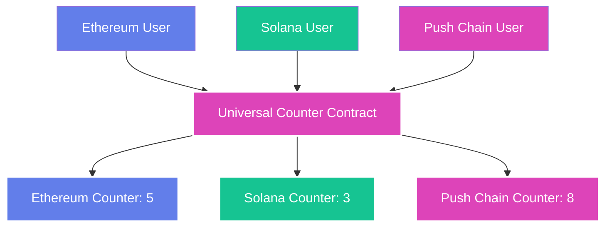

<head>
  <title>Build a Counter App | Tutorials | Push Chain Docs</title>
</head>

import Tabs from '@theme/Tabs';
import TabItem from '@theme/TabItem';
import {
  ModalContainer,
  ModalSmall,
  ModalWrapper,
} from '@site/src/css/SharedStyling';
import IFrameModal from '@site/src/components/IFrameModal/IFrameModal';
import TutorialTimer from '@site/src/components/TutorialTimer';
import { SolidityCode } from '@site/src/components/SolidityCode';
import { GitHubRepo } from '@site/src/components/GitHubRepo';

<!-- Content Start -->

<TutorialTimer estimatedMinutes={10} />

In this tutorial, you’ll write, deploy, and interact with a Counter contract on Push Chain.

We will start with the most popular smart contract, i.e., `Counter.sol`, that all Solidity devs are familiar with. You would have done the following by the end:

- ✅ Build and deploy Counter.sol
- ✅ Interact with it from any chain
- ✅ Understand the benefits of building Universal Apps
- ✅ Use **Live Playground** to test and interact with Counter
- 🔜 Extend to a Universal Counter that tracks chain specific users

## Write the Contract
The process of building a simple smart contract like a counter is exactly similar to any other EVM Chain.
You can use the same tools, such as, remix, foundry, hardhat, etc.

To get started, you can use the following contract:

<SolidityCode
  title="Counter Contract"
  fileName="Counter.sol"
  url="https://github.com/pushchain/push-chain-examples/blob/main/tutorials/simple-counter/contracts/src/Counter.sol"
>

```solidity
// SPDX-License-Identifier: MIT
pragma solidity ^0.8.22;

contract Counter {
    uint256 public countPC;
    event CountIncremented(uint256 indexed countPC, address indexed caller);

    function increment() public {
        countPC += 1;
        emit CountIncremented(countPC, msg.sender);
    }

    function reset() public {
        countPC = 0;
    }
}
```

</SolidityCode>

## Understanding the Contract

This contract is a minimal counter:

- The variable `count` stores the number of times the counter has been incremented.
- The `increment()` function adds `+1` each time it is called.
- The `getCount()` function lets anyone read the current counter value.

> **Key takeaway**
> On Push Chain, this contract works **universally**. A user on Ethereum, Solana, Push or any other chain itself can all call `increment()` — with no code changes.

## Compile & Deploy

You can use any of the following guides to build and deploy this contract on Push Chain:

1. [Remix IDE](https://remix.ethereum.org/)
2. [Foundry Configuration](/docs/chain/setup/smart-contract-environment/configure-foundry/)
3. [Hardhat Configuration](/docs/chain/setup/smart-contract-environment/configure-hardhat/)

Once deployed, you can interact with the Counter contract just like on any other EVM-compatible chain.

## Verify Contract

If you are using Foundry or Hardhat, the contract is already verified for you. If you are using Remix, you can verify the contract on the Push Chain Explorer by going to [verify and publish contract](https://donut.push.network/contract-verification).

## Interact with Counter

The easiest way to interact with the contract is through the Live Playground.
The Counter is already deployed on Push Chain Testnet.

> **Counter Contract Address:** [0x5FbDB2315678afecb367f032d93F642f64180aa3](https://donut.push.network/address/0x5FbDB2315678afecb367f032d93F642f64180aa3?tab=contract)

**Steps to interact:**
- Connect your wallet to the Live Playground.
- You can connect a wallet from any supported chain (Push Chain, Ethereum, or Solana).
- Click **Increment Counter** to increase the counter.
- Click **Refresh Counter Values** to update the display.
- After each transaction, use the transaction hash link to view details in Push Chain Explorer.

## Live Playground

```jsx live
import React, { useState, useEffect } from 'react';
import { ethers } from 'ethers';
import {
  PushUniversalWalletProvider,
  PushUniversalAccountButton,
  usePushWalletContext,
  usePushChainClient,
  PushUI,
} from '@pushchain/ui-kit';

function CounterExample() {
  // Define Wallet Config
  const walletConfig = {
    network: PushUI.CONSTANTS.PUSH_NETWORK.TESTNET,
  };

  // Define Counter ABI, taking minimal ABI for the demo
  const UCABI = [
    {
      inputs: [],
      name: 'increment',
      outputs: [],
      stateMutability: 'nonpayable',
      type: 'function',
    },
    {
      inputs: [],
      name: 'countPC',
      outputs: [
        {
          internalType: 'uint256',
          name: '',
          type: 'uint256',
        },
      ],
      stateMutability: 'view',
      type: 'function',
    },
  ];

  // Contract address for Counter
  const CONTRACT_ADDRESS = '0x5FbDB2315678afecb367f032d93F642f64180aa3';

  function Component() {
    const { connectionStatus } = usePushWalletContext();
    const { pushChainClient } = usePushChainClient();

    // State to store counter values
    const [countPC, setCountPC] = useState(-1);
    const [isLoadingIncrement, setIsLoadingIncrement] = useState(false);
    const [isLoadingReset, setIsLoadingReset] = useState(false);
    const [txHash, setTxHash] = useState('');

    // Function to encode increment transaction data
    const getIncrementTxData = () => {
      return PushChain.utils.helpers.encodeTxData({
        abi: UCABI,
        functionName: 'increment',
      });
    };

    // Function to fetch counter values
    const fetchCounters = async () => {
      try {
        const provider = new ethers.JsonRpcProvider(
          'https://evm.rpc-testnet-donut-node1.push.org/'
        );
        const contract = new ethers.Contract(CONTRACT_ADDRESS, UCABI, provider);

        const pcCount = await contract.countPC();
        setCountPC(Number(pcCount));
      } catch (err) {
        console.error('Error fetching counter values:', err);
      }
    };

    // Fetch counter values on component mount
    useEffect(() => {
      fetchCounters();
    }, []);

    // Handle transaction to increment counter
    const handleSendTransaction = async () => {
      if (pushChainClient) {
        try {
          setIsLoadingIncrement(true);
          const data = getIncrementTxData();

          const tx = await pushChainClient.universal.sendTransaction({
            to: CONTRACT_ADDRESS,
            value: BigInt(0),
            data: data,
          });

          setTxHash(tx.hash);
          await tx.wait();

          await fetchCounters();
          setIsLoadingIncrement(false);
        } catch (err) {
          console.error('Transaction error:', err);
          setIsLoadingIncrement(false);
        }
      }
    };

    return (
      <div
        style={{
          display: 'flex',
          flexDirection: 'column',
          alignItems: 'center',
          gap: '12px',
        }}
      >
        <h2>Counter Example</h2>

        <PushUniversalAccountButton />

        {connectionStatus !== PushUI.CONSTANTS.CONNECTION.STATUS.CONNECTED && (
          <p>Please connect your wallet to interact with the counter.</p>
        )}

        <div
          style={{
            display: 'flex',
            flexDirection: 'column',
            alignItems: 'center',
            gap: '12px',
            width: '100%',
            flexWrap: 'nowrap',
          }}
        >
          <h3>Counter: {countPC == -1 ? '...' : countPC}</h3>
        </div>

        {connectionStatus === PushUI.CONSTANTS.CONNECTION.STATUS.CONNECTED && (
          <div className='counter-container' style={{ display: 'flex', flexDirection: 'column', gap: '16px', alignItems: 'center' }}>
            <div style={{ display: 'flex', justifyContent: 'center', gap: '20px' }}>
              <button
                className='increment-button'
                onClick={handleSendTransaction}
                disabled={isLoadingIncrement}
                style={{
                  backgroundColor: '#d946ef',
                  color: 'white',
                  border: 'none',
                  borderRadius: '20px',
                  padding: '8px 16px',
                  fontSize: '14px',
                  cursor: 'pointer',
                  fontWeight: 'bold'
                }}
              >
                {isLoadingIncrement ? 'Processing...' : 'Increment Counter'}
              </button>
            </div>

            {txHash && pushChainClient && (
              <div className='transaction-info' style={{ textAlign: 'center' }}>
                <p>
                  Transaction Hash:{' '}
                  <a
                    href={pushChainClient.explorer.getTransactionUrl(txHash)}
                    target='_blank'
                    style={{ color: '#d946ef', textDecoration: 'underline' }}
                  >
                    {txHash}
                  </a>
                </p>
              </div>
            )}
          </div>
        )}
      </div>
    );
  }

  return (
    <PushUniversalWalletProvider config={walletConfig}>
      <Component />
    </PushUniversalWalletProvider>
  );
}
```
## Source Code

<GitHubRepo
  title="Counter Tutorial"
  repoUrl="https://github.com/pushchain/push-chain-examples/tree/main/tutorials/simple-counter"
  description="Full source code for the Universal Counter smart contract and example frontend."
/>

## What we Achieved

This was just a simple tutorial. What we did in this tutorial:

- Deployed a counter contract on Push Chain.
- Interacted seamlessly with the contract from any chain. (Ethereum, Solana or Push Chain)


## Next Tutorial

The next tutorial introduces the true power of **Universal Apps**.

<div style={{textAlign: 'center'}}>



</div>

<hr />

In the next part, we modify this contract to implement the following:

1. `increment()` called by users of **any chain** will now be attributed to them.
2. The contract will natively detect which chain the `msg.sender` belongs to.
3. The contract will maintain a `count` for each chain based on the caller’s origin.

> All of these features will be natively supported in the contract with no requirement of
> third-party oracles, interop providers or packages.
> **This is only possible on Push Chain.**
