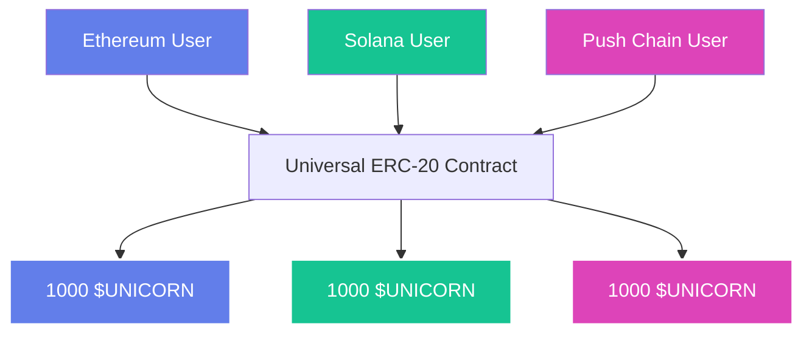

<head>
  <title>Build a Universal Counter App | Tutorials | Push Chain Docs</title>
</head>

import Tabs from '@theme/Tabs';
import TabItem from '@theme/TabItem';
import {
  ModalContainer,
  ModalSmall,
  ModalWrapper,
} from '@site/src/css/SharedStyling';
import IFrameModal from '@site/src/components/IFrameModal/IFrameModal';
import TutorialTimer from '@site/src/components/TutorialTimer';
import { SolidityCode } from '@site/src/components/SolidityCode';
import { GitHubRepo } from '@site/src/components/GitHubRepo';

<!-- Content Start -->
<TutorialTimer estimatedMinutes={18} />

:::info Extends Counter App
This tutorial builds on the [Counter](/docs/chain/tutorials/basics/tutorial-simple-counter). If you haven’t completed it yet, go there first as this tutorial builds directly on top of it.
:::

In the last tutorial, you built a counter that worked across chains with no code changes.

Now, let’s take it further: instead of one shared counter, we’ll track **counts per chain**. This is your first truly **Universal App**. Let’s dive in 🤿.

By the end of this tutorial you’ll be able to:

- ✅ Build a counter app that tracks transactions from **different chains**.
- ✅ Use the **UEAFactory interface** to detect a user’s origin.
- ✅ Work with the **UniversalAccountId struct** to fetch chain details.


## What’s Unique About This App?

In the **Counter**, every increment was added to a single shared value. That worked fine, but it didn’t tell us *who* was incrementing or *from where*.

With the **Universal Counter**, we take the next step:
- Each chain gets its **own counter** (`countEth`, `countPC`, `countSol`, …).
- The contract can **natively detect the origin** of the caller (`msg.sender`).
- The `increment()` function updates **only the counter for the caller’s chain**.

### Example
- Alice (Ethereum) → calls `increment()` → only `countEth` goes up.
- Bob (Push Chain) → calls `increment()` → only `countPC` goes up.

> **🚀 Why this matters**
>
> You’re not just tracking clicks anymore. You’re building logic that’s aware of where your users come from. This is the foundation of truly universal apps, and it’s all **natively supported on Push Chain**.

## Write the Contract

Below is the Solidity code for the Universal Counter. In the Beginner version, chains are hardcoded for simplicity.

:::tip Beginner vs Pro
- **Beginner:** Easier to follow. Great if you’re new to Solidity or Push Chain.
- **Pro (Dynamic):** Slightly more advanced. Switch to the **Pro (Dynamic)** version once you’re comfortable — it scales to any chain without edits.
:::

<Tabs className="liveplaytab" groupId="universal-counter-solidity">
  <TabItem value='universal_counter_hardcoded' label='Universal Counter (Beginner)'>

<SolidityCode
  title="Universal Counter Contract"
  fileName="UniversalCounter.sol"
  url="https://github.com/pushchain/push-chain-examples/blob/main/tutorials/universal-counter/contracts/src/UniversalCounter.sol"
>

```solidity
// SPDX-License-Identifier: MIT
pragma solidity ^0.8.22;

// Universal Account ID Struct and IUEAFactory Interface
struct UniversalAccountId {
    string chainNamespace;
    string chainId;
    bytes owner;
}

interface IUEAFactory {
    function getOriginForUEA(address addr) external view returns (UniversalAccountId memory account, bool isUEA);
}

contract UniversalCounter {
    uint256 public countEth;
    uint256 public countSol;
    uint256 public countPC;

    event CountIncremented(
        uint256 newCount,
        address indexed caller,
        string chainNamespace,
        string chainId
    );

    constructor() {}

    function increment() public {
        address caller = msg.sender;
        (UniversalAccountId memory originAccount, bool isUEA) =
            IUEAFactory(0x00000000000000000000000000000000000000eA).getOriginForUEA(caller);

        if (!isUEA) {
            // If it's a native Push Chain EOA (isUEA = false)
            countPC += 1;
        } else {
            bytes32 chainHash = keccak256(abi.encodePacked(originAccount.chainNamespace, originAccount.chainId));

            if (chainHash == keccak256(abi.encodePacked("solana","EtWTRABZaYq6iMfeYKouRu166VU2xqa1"))) {
                countSol += 1;
            } else if (chainHash == keccak256(abi.encodePacked("eip155","11155111"))) {
                countEth += 1;
            } else {
                revert("Invalid chain");
            }
        }

        emit CountIncremented(getCount(), caller, originAccount.chainNamespace, originAccount.chainId);
    }

    function getCount() public view returns (uint256) {
        return countEth + countSol + countPC;
    }
}
```

</SolidityCode>

</TabItem>

<TabItem value='universal_counter_dynamic' label='Universal Counter (Dynamic / Pro)'>

<SolidityCode
  title="Universal Counter Dynamic Contract"
  fileName="UniversalCounterDynamic.sol"
  url="https://github.com/pushchain/push-chain-examples/blob/main/tutorials/universal-counter-dynamic/contracts/src/UniversalCounterDynamic.sol"
>

```solidity
// Note: Unlike the Beginner version, this contract also tracks unique users per chain.
// SPDX-License-Identifier: MIT
pragma solidity ^0.8.22;

// Universal Account ID Struct and IUEAFactory Interface
struct UniversalAccountId {
    string chainNamespace;
    string chainId;
    bytes owner;
}

interface IUEAFactory {
    function getOriginForUEA(address addr) external view returns (UniversalAccountId memory account, bool isUEA);
}

contract UniversalCounter {
    // Counter mapping to maintain individual chain counts
    mapping(bytes => uint256) public chainCount;
    mapping(bytes => uint256) public chainCountUnique;

    // Array of chain IDs to track unique chains
    bytes[] public chainIds;

    // Array of chain users to track unique counts
    mapping(address => bool) public chainUsers;

    event CountIncremented(
        uint256 newCount,
        uint256 newCountUnique,
        address indexed caller,
        string chainNamespace,
        string chainId
    );

    constructor() {}

    function increment() public {
        address caller = msg.sender;
        (UniversalAccountId memory originAccount, bool isUEA) =
            IUEAFactory(0x00000000000000000000000000000000000000eA).getOriginForUEA(caller);

        // Calculate chain hash
        bytes memory chainHash = abi.encodePacked(originAccount.chainNamespace, ":", originAccount.chainId);

        if (chainCount[chainHash] == 0) {
            // Add new chain to chainIds if it doesn't exist
            chainIds.push(chainHash);
        }

        if (chainUsers[caller] == false) {
          // add to chain unique count if user is not already counted
          chainCountUnique[chainHash] += 1;
          chainUsers[caller] = true;
        }

        // Add to chain count
        chainCount[chainHash] += 1;

        (uint256 totalCount, uint256 totalCountUnique) = getCount();
        emit CountIncremented(totalCount, totalCountUnique, caller, originAccount.chainNamespace, originAccount.chainId);
    }

    function getCount() public view returns (uint256 count, uint256 countUnique) {
      uint256 totalCount = 0;
      uint256 totalCountUnique = 0;

      for (uint256 i = 0; i < chainIds.length; i++) {
        totalCount += chainCount[chainIds[i]];
        totalCountUnique += chainCountUnique[chainIds[i]];
      }

      return (totalCount, totalCountUnique);
    }
}
```

</SolidityCode>

</TabItem>

</Tabs>

## Understanding the Contract

This contract can now instantly determine key details about any user **(msg.sender)** instantly and natively.

In simpler terms, for any given **msg.sender** address, the contract is able to quickly identify:
1. _the actual source chain of the caller_
2. _the chain id of the source chain of the caller._
3. _the address of the caller on the source chain._

These details are natively available for any smart contract built on Push Chain.
This is enabled via **[UEAFactory Interface](https://github.com/pushchain/push-chain-core-contracts/blob/main/src/Interfaces/IUEAFactory.sol)**.

### Understanding UEAFactory Interface
We use UEAFactory interface to decide transaction origin of the user. It stands for **Universal Execution Account** (UEA). Think of a UEA like a passport contract, it proves which chain a user comes from.

_This can either be imported or directly included in your contract._

This interfaces provides you with the function - `getOriginForUEA()`.
```solidity
/**
  * @dev Returns the owner key (UOA) for a given UEA address
  * @param addr Any given address ( msg.sender ) on push chain
  * @return account The Universal Account information associated with this UEA
  * @return isUEA True if the address addr is a UEA contract. Else it is a native EOA of PUSH chain (i.e., isUEA = false)
  */
function getOriginForUEA(address addr) external view returns (UniversalAccountId memory account, bool isUEA);
```
The function mainly returns 2 crucial values:
- The **UniversalAccountId** of the user, and
- A boolean that indicates whether or not this caller is a UEA.

### Designing the Increment Function


```solidity title="UniversalCounter.sol"
...
function increment() public {
  address caller = msg.sender;
  // highlight-start
  (UniversalAccountId memory originAccount, bool isUEA) =
      IUEAFactory(0x00000000000000000000000000000000000000eA).getOriginForUEA(caller);
  // highlight-end

  if (!isUEA) {
      // If it's a native Push Chain EOA (isUEA = false)
      countPC += 1;
  } else {
      bytes32 chainHash = keccak256(abi.encodePacked(originAccount.chainNamespace, originAccount.chainId));

      if (chainHash == keccak256(abi.encodePacked("solana","EtWTRABZaYq6iMfeYKouRu166VU2xqa1"))) {
          countSol += 1;
      } else if (chainHash == keccak256(abi.encodePacked("eip155","11155111"))) {
          countEth += 1;
      }
      // ...
  }
  // ...
}
// ...
```

The `increment` function is the main logic of this contract that updates the count variables based on user’s origin type.

In order to achieve this, the `increment` function does the following:

- calls the `getOriginForUEA()` with **msg.sender** as argument
- this provides us with **isUEA and UniversalAccountId** for the caller.
- then we check if **isUEA is false,** this means the caller is a native Push User.
- for such users, the function increments `countPC` variable by 1

<details>
  <summary><strong>Why isUEA = false means native Push User and true means other chains?</strong></summary>

  <p>1. Every external chain user (ETH, Solana, etc) in Push Chain has a UEA account deployed for them.</p>
  <p>2. These UEA accounts represent the external chain users on Push Chain and are directly controlled by their signatures.</p>
  <p>3. UEAs allow external users to interact and use Push Chain apps without natively being on Push Chain.</p>
  <p>4. Therefore, for a given <code>msg.sender</code>:</p>
  <ul>
    <li><strong>isUEA = false</strong> → the caller is a native Push Chain account and not an external chain user.</li>
    <li><strong>isUEA = true</strong> → the caller is an external chain user interacting via a UEA. For such a user, the <code>UniversalAccountId</code> provides all information like <em>\{ chainName, chainId, ownerAddress \}</em>.</li>
  </ul>

</details>

## Compile & Deploy

You can use any of the following guides to build and deploy this contract on Push Chain:

1. [Remix IDE](https://remix.ethereum.org/)
2. [Foundry Configuration](/docs/chain/setup/smart-contract-environment/configure-foundry/)
3. [Hardhat Configuration](/docs/chain/setup/smart-contract-environment/configure-hardhat/)

Once deployed, you can interact with the Counter contract just like on any other EVM-compatible chain.

## Verify Contract

If you are using Foundry or Hardhat, the contract is already verified for you. If you are using Remix, you can verify the contract on the Push Chain Explorer by going to [verify and publish contract](https://donut.push.network/contract-verification).

## Interact with Universal Counter

The easiest way to interact with the contract is through the Live Playground.
The Universal Counter is already deployed on Push Chain Testnet.

> **UniversalCounter (Beginner) :** [0xe7f1725E7734CE288F8367e1Bb143E90bb3F0512](https://donut.push.network/address/0xe7f1725E7734CE288F8367e1Bb143E90bb3F0512?tab=contract)
> **UniversalCounter (Dynamic / Pro) :** [0xDc64a140Aa3E981100a9becA4E685f962f0cF6C9](https://donut.push.network/address/0xDc64a140Aa3E981100a9becA4E685f962f0cF6C9?tab=contract)

**Steps to interact:**
- Connect your wallet to the Live Playground.
- You can connect a wallet from any supported chain (Push Chain, Ethereum, or Solana).
- Click **Increment Counter** to increase the counter for your chain.
- Click **Refresh Counter Values** to see updated counts across chains.
- Click **View in Explorer** to open the transaction in Push Chain Explorer.

## Live Playground

<Tabs className="liveplaytab" groupId="universal-counter-solidity">
  <TabItem value='universal_counter_hardcoded' label='Universal Counter (Beginner)'>

```jsx live
// customPropMinimized='true'
import React, { useState, useEffect } from 'react';
import { ethers } from 'ethers';
import {
  PushUniversalWalletProvider,
  PushUniversalAccountButton,
  usePushWalletContext,
  usePushChainClient,
  PushUI,
} from '@pushchain/ui-kit';

function UniversalCounterExample() {
  // Define Wallet Config
  const walletConfig = {
    network: PushUI.CONSTANTS.PUSH_NETWORK.TESTNET,
  };

  // Define Universal Counter ABI, taking minimal ABI for the demo
  const UCABI = [
    {
      inputs: [],
      name: 'increment',
      outputs: [],
      stateMutability: 'nonpayable',
      type: 'function',
    },
    {
      inputs: [],
      name: 'countEth',
      outputs: [
        {
          internalType: 'uint256',
          name: '',
          type: 'uint256',
        },
      ],
      stateMutability: 'view',
      type: 'function',
    },
    {
      inputs: [],
      name: 'countPC',
      outputs: [
        {
          internalType: 'uint256',
          name: '',
          type: 'uint256',
        },
      ],
      stateMutability: 'view',
      type: 'function',
    },
    {
      inputs: [],
      name: 'countSol',
      outputs: [
        {
          internalType: 'uint256',
          name: '',
          type: 'uint256',
        },
      ],
      stateMutability: 'view',
      type: 'function',
    },
  ];

  // Contract address for Universal Counter
  const CONTRACT_ADDRESS = '0xe7f1725E7734CE288F8367e1Bb143E90bb3F0512';

  function Component() {
    const { connectionStatus } = usePushWalletContext();
    const { pushChainClient } = usePushChainClient();

    // State to store counter values
    const [countEth, setCountEth] = useState(-1);
    const [countSol, setCountSol] = useState(-1);
    const [countPC, setCountPC] = useState(-1);
    const [isLoading, setIsLoading] = useState(false);
    const [txHash, setTxHash] = useState('');

    // Function to encode transaction data
    const getTxData = () => {
      return PushChain.utils.helpers.encodeTxData({
        abi: UCABI,
        functionName: 'increment',
      });
    };

    // Function to fetch counter values
    const fetchCounters = async () => {
      try {
        // Create a contract instance for read operations
        const provider = new ethers.JsonRpcProvider(
          'https://evm.rpc-testnet-donut-node1.push.org/'
        );
        const contract = new ethers.Contract(CONTRACT_ADDRESS, UCABI, provider);

        // Fetch counter values
        const ethCount = await contract.countEth();
        const solCount = await contract.countSol();
        const pcCount = await contract.countPC();

        // Update state
        setCountEth(Number(ethCount));
        setCountSol(Number(solCount));
        setCountPC(Number(pcCount));
      } catch (err) {
        console.error('Error fetching counter values:', err);
      }
    };

    // Fetch counter values on component mount
    useEffect(() => {
      fetchCounters();
    }, []);

    // Handle transaction to increment counter
    const handleSendTransaction = async () => {
      if (pushChainClient) {
        try {
          setIsLoading(true);
          const data = getTxData();

          const tx = await pushChainClient.universal.sendTransaction({
            to: CONTRACT_ADDRESS,
            value: BigInt(0),
            data: data,
          });

          setTxHash(tx.hash);

          // Wait for transaction to be mined
          await tx.wait();

          // Refresh counter values
          await fetchCounters();
          setIsLoading(false);
        } catch (err) {
          console.error('Transaction error:', err);
          setIsLoading(false);
        }
      }
    };

    // Function to determine which chain is winning
    const getWinningChain = () => {
      if (countEth === -1 || countSol === -1 || countPC === -1) return null;

      if (countEth > countSol && countEth > countPC) {
        return `Ethereum is winning with ${countEth} counts`;
      } else if (countSol > countEth && countSol > countPC) {
        return `Solana is winning with ${countSol} counts`;
      } else if (countPC > countEth && countPC > countSol) {
        return `Push Chain is winning with ${countPC} counts`;
      } else {
        // Handle ties
        if (countEth === countSol && countEth === countPC && countEth > 0) {
          return `It's a three-way tie with ${countEth} counts each`;
        } else if (countEth === countSol && countEth > countPC) {
          return `Ethereum and Solana are tied with ${countEth} counts each`;
        } else if (countEth === countPC && countEth > countSol) {
          return `Ethereum and Push Chain are tied with ${countEth} counts each`;
        } else if (countSol === countPC && countSol > countEth) {
          return `Solana and Push Chain are tied with ${countSol} counts each`;
        } else {
          return null; // No winner yet or all zeros
        }
      }
    };

    const winningMessage = getWinningChain();

    return (
      <div
        style={{
          display: 'flex',
          flexDirection: 'column',
          alignItems: 'center',
          gap: '12px',
        }}
      >
        <h2>Universal Counter Example</h2>

        <PushUniversalAccountButton />

        {connectionStatus !== PushUI.CONSTANTS.CONNECTION.STATUS.CONNECTED && (
          <p>Please connect your wallet to interact with the counter.</p>
        )}

        <div
          style={{
            display: 'flex',
            flexDirection: 'column',
            alignItems: 'center',
            gap: '12px',
            width: '100%',
            flexWrap: 'nowrap',
          }}
        >
          <h3>
            Total Universal Count:{' '}
            {countEth == -1 ? '...' : countEth + countSol + countPC}
          </h3>

          <div
            style={{
              display: 'flex',
              flexDirection: 'row',
              alignItems: 'center',
              justifyContent: 'space-around',
              gap: '12px',
              width: '100%',
            }}
          >
            <div className='counter-box'>
              <h3>ETH Counter: {countEth == -1 ? '...' : countEth}</h3>
            </div>

            <div className='counter-box'>
              <h3>Sol Counter: {countSol == -1 ? '...' : countSol}</h3>
            </div>

            <div className='counter-box'>
              <h3>PC Counter: {countPC == -1 ? '...' : countPC}</h3>
            </div>
          </div>
        </div>

        {connectionStatus === PushUI.CONSTANTS.CONNECTION.STATUS.CONNECTED && (
          <div className='counter-container' style={{ display: 'flex', flexDirection: 'column', gap: '16px', alignItems: 'center' }}>
            <div style={{ display: 'flex', justifyContent: 'center', gap: '20px' }}>
              <button
                className='increment-button'
                onClick={handleSendTransaction}
                disabled={isLoading}
                style={{
                  backgroundColor: '#d946ef',
                  color: 'white',
                  border: 'none',
                  borderRadius: '20px',
                  padding: '8px 16px',
                  fontSize: '14px',
                  cursor: 'pointer',
                  fontWeight: 'bold'
                }}
              >
                {isLoading ? 'Processing...' : 'Increment Counter'}
              </button>

              <button
                className='refresh-button'
                onClick={fetchCounters}
                style={{
                  backgroundColor: '#d946ef',
                  color: 'white',
                  border: 'none',
                  borderRadius: '20px',
                  padding: '8px 16px',
                  fontSize: '14px',
                  cursor: 'pointer',
                  fontWeight: 'bold'
                }}
              >
                Refresh Counter Values
              </button>
            </div>

            {winningMessage && (
              <div style={{ margin: '10px 0', fontWeight: 'bold', color: '#d946ef' }}>
                {winningMessage}
              </div>
            )}

            {txHash && pushChainClient && (
              <div className='transaction-info' style={{ textAlign: 'center' }}>
                <p>
                  Transaction Hash:{' '}
                  <a
                    href={pushChainClient.explorer.getTransactionUrl(txHash)}
                    target='_blank'
                    style={{ color: '#d946ef', textDecoration: 'underline' }}
                  >
                    {txHash}
                  </a>
                </p>
              </div>
            )}
          </div>
        )}
      </div>
    );
  }

  return (
    <PushUniversalWalletProvider config={walletConfig}>
      <Component />
    </PushUniversalWalletProvider>
  );
}
```

</TabItem>
<TabItem value='universal_counter_dynamic' label='Universal Counter (Dynamic / Pro)'>

```jsx live
// customPropMinimized='true'
import React, { useState, useEffect } from 'react';
import { ethers } from 'ethers';
import {
  PushUniversalWalletProvider,
  PushUniversalAccountButton,
  usePushWalletContext,
  usePushChainClient,
  usePushChain,
  PushUI,
} from '@pushchain/ui-kit';

function UniversalCounterExample() {
  // Define Wallet Config
  const walletConfig = {
    network: PushUI.CONSTANTS.PUSH_NETWORK.TESTNET,
  };

  // Define Universal Counter ABI, taking minimal ABI for the demo
  const UCDynamicABI = [
    { "inputs": [], "stateMutability": "nonpayable", "type": "constructor" },
    {
      "anonymous": false,
      "inputs": [
        {
          "indexed": false,
          "internalType": "uint256",
          "name": "newCount",
          "type": "uint256"
        },
        {
          "indexed": false,
          "internalType": "uint256",
          "name": "newCountUnique",
          "type": "uint256"
        },
        {
          "indexed": true,
          "internalType": "address",
          "name": "caller",
          "type": "address"
        },
        {
          "indexed": false,
          "internalType": "string",
          "name": "chainNamespace",
          "type": "string"
        },
        {
          "indexed": false,
          "internalType": "string",
          "name": "chainId",
          "type": "string"
        }
      ],
      "name": "CountIncremented",
      "type": "event"
    },
    {
      "inputs": [{ "internalType": "bytes", "name": "", "type": "bytes" }],
      "name": "chainCount",
      "outputs": [{ "internalType": "uint256", "name": "", "type": "uint256" }],
      "stateMutability": "view",
      "type": "function"
    },
    {
      "inputs": [{ "internalType": "bytes", "name": "", "type": "bytes" }],
      "name": "chainCountUnique",
      "outputs": [{ "internalType": "uint256", "name": "", "type": "uint256" }],
      "stateMutability": "view",
      "type": "function"
    },
    {
      "inputs": [{ "internalType": "uint256", "name": "", "type": "uint256" }],
      "name": "chainIds",
      "outputs": [{ "internalType": "bytes", "name": "", "type": "bytes" }],
      "stateMutability": "view",
      "type": "function"
    },
    {
      "inputs": [{ "internalType": "address", "name": "", "type": "address" }],
      "name": "chainUsers",
      "outputs": [{ "internalType": "bool", "name": "", "type": "bool" }],
      "stateMutability": "view",
      "type": "function"
    },
    {
      "inputs": [],
      "name": "getCount",
      "outputs": [
        { "internalType": "uint256", "name": "count", "type": "uint256" },
        { "internalType": "uint256", "name": "countUnique", "type": "uint256" }
      ],
      "stateMutability": "view",
      "type": "function"
    },
    {
      "inputs": [],
      "name": "increment",
      "outputs": [],
      "stateMutability": "nonpayable",
      "type": "function"
    },
  ];

  // Contract address for Universal Counter
  const COUNTER_CONTRACT_ADDRESS = '0xDc64a140Aa3E981100a9becA4E685f962f0cF6C9';

  function Component() {
    const { connectionStatus } = usePushWalletContext();
    const { pushChainClient } = usePushChainClient();
    const { PushChain } = usePushChain();

    // State to store counter values
    const [counter, setCounter] = useState<number>(0);
    const [chainData, setChainData] = useState<Array<{chainHash: string, count: number, uniqueCount: number}>>([]);

    const [isLoading, setIsLoading] = useState(false);
    const [txHash, setTxHash] = useState<string>("");


    // Function to encode transaction data
    const getTxData = () => {
      return PushChain.utils.helpers.encodeTxData({
        abi: UCDynamicABI,
        functionName: 'increment',
      });
    };

    // Function to fetch counter values
    const fetchCounter = async () => {
      try {
        const provider = new ethers.JsonRpcProvider(
          'https://evm.rpc-testnet-donut-node1.push.org/'
        );

        const contract = new ethers.Contract(
          COUNTER_CONTRACT_ADDRESS,
          UCDynamicABI,
          provider
        );

        const [totalCount] = await contract.getCount();
        setCounter(Number(totalCount));

        // Get all chain data
        const newChainData: Array<{chainHash: string, count: number, uniqueCount: number}> = [];
        let chainIndex = 0;

        try {
          while (true) {
            const chainHash = await contract.chainIds(chainIndex);
            const count = await contract.chainCount(chainHash);
            const uniqueCount = await contract.chainCountUnique(chainHash);

            newChainData.push({
              chainHash: ethers.hexlify(chainHash),
              count: Number(count),
              uniqueCount: Number(uniqueCount)
            });

            chainIndex++;
          }
        } catch (error) {
          // Expected error when we reach the end of the array
        }
        setChainData(newChainData);
      } catch (err) {
        console.error("Error reading counter:", err);
      }
    };

    // Handle transaction to increment counter
    const handleSendTransaction = async () => {
      if (pushChainClient) {
        try {
          setIsLoading(true);

          // Send transaction to increment counter
          const tx = await pushChainClient.universal.sendTransaction({
            to: COUNTER_CONTRACT_ADDRESS,
            data: PushChain.utils.helpers.encodeTxData({
              abi: UCDynamicABI,
              functionName: "increment",
            }),
            value: BigInt(0),
          });

          setTxHash(tx.hash);

          // Wait for transaction to be mined
          await tx.wait();

          // Refresh counter values
          await fetchCounter();

          setIsLoading(false);
        } catch (err) {
          console.error("Transaction error:", err);
          setIsLoading(false);
        }
      } else {
        console.log("Please connect your wallet first");
      }
    };

    // Read counter value on component mount
    useEffect(() => {
      fetchCounter();
    }, []);

    return (
      <div
        style={{
          display: 'flex',
          flexDirection: 'column',
          alignItems: 'center',
          gap: '12px',
        }}
      >
        <h2>Universal Counter Example</h2>

        <PushUniversalAccountButton />

        {connectionStatus !== PushUI.CONSTANTS.CONNECTION.STATUS.CONNECTED && (
          <p>Please connect your wallet to interact with the counter.</p>
        )}

        <div
          style={{
            display: 'flex',
            flexDirection: 'column',
            alignItems: 'center',
            gap: '12px',
            width: '100%',
            flexWrap: 'nowrap',
          }}
        >
          <h3>
            Total Universal Count:{' '}
            {counter == -1 ? '...' : counter}
          </h3>

          <div
            style={{
              display: 'flex',
              flexDirection: 'row',
              alignItems: 'center',
              justifyContent: 'space-around',
              gap: '12px',
              width: '100%',
            }}
          >
            {chainData.length > 0 && (
              <div style={{ marginTop: "2rem", maxWidth: "600px" }}>
                <h3 style={{ fontSize: "1.2rem", marginBottom: "1rem", color: "#333" }}>Chain Data</h3>
                <table style={{
                  width: "100%",
                  borderCollapse: "collapse",
                  fontSize: "0.9rem",
                  backgroundColor: "white",
                  borderRadius: "8px",
                  overflow: "hidden",
                  boxShadow: "0 2px 4px rgba(0,0,0,0.1)"
                }}>
                  <thead>
                    <tr style={{ backgroundColor: "#f8f9fa" }}>
                      <th style={{ padding: "12px", textAlign: "left", borderBottom: "1px solid #dee2e6" }}>Chain Name</th>
                      <th style={{ padding: "12px", textAlign: "center", borderBottom: "1px solid #dee2e6" }}>Count</th>
                      <th style={{ padding: "12px", textAlign: "center", borderBottom: "1px solid #dee2e6" }}>Unique Count</th>
                    </tr>
                  </thead>
                  <tbody>
                    {chainData.map((chain, index) => (
                      <tr key={index} style={{ borderBottom: index < chainData.length - 1 ? "1px solid #dee2e6" : "none" }}>
                        <td style={{ padding: "12px", fontFamily: "monospace", fontSize: "0.8rem", wordBreak: "break-all" }}>
                          {PushChain.utils.helpers.getChainName(ethers.toUtf8String(chain.chainHash))}
                        </td>
                        <td style={{ padding: "12px", textAlign: "center", fontWeight: "bold" }}>
                          {chain.count}
                        </td>
                        <td style={{ padding: "12px", textAlign: "center", fontWeight: "bold" }}>
                          {chain.uniqueCount}
                        </td>
                      </tr>
                    ))}
                  </tbody>
                </table>
              </div>
            )}
          </div>
        </div>

        {connectionStatus === PushUI.CONSTANTS.CONNECTION.STATUS.CONNECTED && (
          <div className='counter-container' style={{ display: 'flex', flexDirection: 'column', gap: '16px', alignItems: 'center' }}>
            <div style={{ display: 'flex', justifyContent: 'center', gap: '20px' }}>
              <button
                className='increment-button'
                onClick={handleSendTransaction}
                disabled={isLoading}
                style={{
                  backgroundColor: '#d946ef',
                  color: 'white',
                  border: 'none',
                  borderRadius: '20px',
                  padding: '8px 16px',
                  fontSize: '14px',
                  cursor: 'pointer',
                  fontWeight: 'bold'
                }}
              >
                {isLoading ? 'Processing...' : 'Increment Counter'}
              </button>

              <button
                className='refresh-button'
                onClick={fetchCounter}
                style={{
                  backgroundColor: '#d946ef',
                  color: 'white',
                  border: 'none',
                  borderRadius: '20px',
                  padding: '8px 16px',
                  fontSize: '14px',
                  cursor: 'pointer',
                  fontWeight: 'bold'
                }}
              >
                Refresh Counter Values
              </button>
            </div>

            {txHash && pushChainClient && (
              <div className='transaction-info' style={{ textAlign: 'center' }}>
                <p>
                  Transaction Hash:{' '}
                  <a
                    href={pushChainClient.explorer.getTransactionUrl(txHash)}
                    target='_blank'
                    style={{ color: '#d946ef', textDecoration: 'underline' }}
                  >
                    {txHash}
                  </a>
                </p>
              </div>
            )}
          </div>
        )}
      </div>
    );
  }

  return (
    <PushUniversalWalletProvider config={walletConfig}>
      <Component />
    </PushUniversalWalletProvider>
  );
}
```

</TabItem>

</Tabs>

## Source Code

<GitHubRepo
  title="Universal Counter Tutorial"
  repoUrl="https://github.com/pushchain/push-chain-examples/tree/main/tutorials/universal-counter"
  description="Full source code for the Universal Counter (hard coded chains) smart contract and example frontend."
/>

<GitHubRepo
  title="Universal Counter (Dynamic) Tutorial"
  repoUrl="https://github.com/pushchain/push-chain-examples/tree/main/tutorials/universal-counter-dynamic"
  description="Full source code for the Universal Counter (dynamic chains) smart contract and example frontend."
/>

## What we Achieved

With Universal Counter, you can now:

- Identify callers natively from *any* chain.
- Build logic that adapts to the user’s origin chain.
- Simplify the developer experience for multi-chain apps.
- Eliminate reliance on third-party tooling or oracles.

This makes your Counter smart contract **truly universal, all in just a few lines of Solidity**.

## Next Tutorial

The next tutorial introduces **Universal ERC-20** tokens. Your tokens that can be minted by users of any chain.

<div style={{textAlign: 'center'}}>



</div>

<hr />

In the next tutorial, you’ll learn how to:

1. Deploy `ERC-20` contract.
2. Introduce `mint()` functionality accessible to any user.
3. Mint from any chain.

> All of these features will be natively supported in the contract with no requirement of
> third-party oracles, interop providers or packages.
> **This is only possible on Push Chain.**
