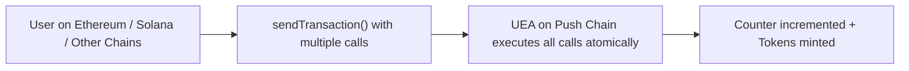

<head>
  <title>Batch Transactions | Tutorials | Push Chain Docs</title>
</head>

import Tabs from '@theme/Tabs';
import TabItem from '@theme/TabItem';
import Details from '@theme/Details';
import IFrameModal from '@site/src/components/IFrameModal/IFrameModal';
import NodeJSVirtualIDE from '@site/src/components/NodeJSVirtualIDE/NodeJSVirtualIDE';
import TutorialTimer from '@site/src/components/TutorialTimer';
import { SolidityCode } from '@site/src/components/SolidityCode';
import { GitHubRepo } from '@site/src/components/GitHubRepo';

<!-- Content Start -->

<TutorialTimer estimatedMinutes={8} />

In this tutorial, you’ll learn how to **execute multiple smart contract calls in a single transaction** on Push Chain, also known as **Multicall** or **Batch Transactions**.

This is one of Push Chain’s most powerful features, letting you do multiple actions such as approvals, transfers, or any contract interactions in a single transaction. 

By the end, you’ll be able to:

- ✅ Bundle multiple contract calls into one universal transaction.  
- ✅ Execute them atomically on Push Chain (all succeed or none do).  
- ✅ Reuse the same approach for your own app logic.

## Understanding Multicall

In traditional dApps, every interaction requires its own transaction — users approve, then transfer, then call another contract.

With Push Chain’s **Universal Execution Account (UEA)** model, you can include an array of calls in a single `sendTransaction()`.

The SDK automatically encodes and executes them in sequence, ensuring atomicity.

**Requirements**: Batch transactions run from **external origin chains** and execute atomically on Push Chain.

## Contracts Used

We’ll reuse two contracts from earlier tutorials and interact with **both** from an external origin chain in a single universal transaction:

- `Counter.sol` from [Simple Counter Tutorial](/docs/chain/tutorials/basics/tutorial-simple-counter/) → to increment the counter.
- `ERC20.sol` from [Mint Universal ERC-20 Tutorial](/docs/chain/tutorials/basics/tutorial-mint-erc-20-tokens/) → to mint $UNICORN token.

<Tabs className="liveplaytab" groupId="send-universal-transaction-coding">
  <TabItem value='basic_counter' label='Basic Counter'>

<SolidityCode
  title="Counter Contract"
  fileName="Counter.sol"
  url="https://github.com/pushchain/push-chain-examples/blob/main/tutorials/simple-counter/contracts/src/Counter.sol"
>

```solidity
// SPDX-License-Identifier: MIT
pragma solidity ^0.8.22;

contract Counter {
    uint256 public countPC;
    event CountIncremented(uint256 indexed countPC, address indexed caller);

    function increment() public {
        countPC += 1;
        emit CountIncremented(countPC, msg.sender);
    }

    function reset() public {
        countPC = 0;
    }
}
```

</SolidityCode>

  </TabItem>

  <TabItem value='universal_token_mint' label='Universal ERC-20'>

<SolidityCode
    title="Universal ERC-20 Contract"
    fileName="ERC20.sol"
    url="https://github.com/pushchain/push-chain-examples/blob/main/tutorials/universal-erc-20-mint/contracts/src/ERC20.sol"
  >

  ```solidity
  // SPDX-License-Identifier: MIT
  pragma solidity ^0.8.22;

  import "@openzeppelin/contracts/token/ERC20/ERC20.sol";

  contract Token is ERC20 {
      constructor(string memory name, string memory symbol) ERC20(name, symbol) {
          _mint(msg.sender, 1_000_000 * 10 ** decimals());
      }

      function mint(address to, uint256 amount) external {
          _mint(to, amount);
      }
  }
  ```

  </SolidityCode>

  </TabItem>
</Tabs>

<Details summary="Prefer to deploy your own?">
Follow: <br />
- [Build a Counter App](/docs/chain/tutorials/basics/tutorial-simple-counter/)
- [Mint Universal ERC-20 Token](/docs/chain/tutorials/basics/tutorial-mint-erc-20-tokens/)

Then replace the example addresses in this tutorial with your deployments.
</Details>

## Build the Multicall Payload

:::warning Multicall requirements
- **Origin-only:** Batch transactions are supported **only from external origin chains** (not native Push).
- **UEA target:** The `to` field **must** be your Universal Execution Account: `pushChainClient.universal.account`.
- **Atomicity:** If any call fails, the **entire batch reverts**.
:::

```ts
// rest of the code...

// Counter ABI on Push Chain (used in tests) with an increment function
const CounterABI = [
  {
    inputs: [],
    name: 'increment',
    outputs: [],
    stateMutability: 'nonpayable',
    type: 'function',
  },
  {
    inputs: [],
    name: 'countPC',
    outputs: [
      {
        internalType: 'uint256',
        name: '',
        type: 'uint256',
      },
    ],
    stateMutability: 'view',
    type: 'function',
  },
];

// Counter deployed on Push Chain Testnet
const counterAddress = '0x5FbDB2315678afecb367f032d93F642f64180aa3';

// Create function call for Counter.increment()
const incrementData = PushChain.utils.helpers.encodeTxData({
  abi: CounterABI,
  functionName: 'increment',
});

// ERC20 ABI on Push Chain (used in tests) with a mint function
const ERC20ABI = [
  {
    inputs: [
      { name: 'to', type: 'address' },
      { name: 'amount', type: 'uint256' },
    ],
    name: 'mint',
    outputs: [],
    stateMutability: 'nonpayable',
    type: 'function',
  },
  {
    inputs: [
      { name: 'account', type: 'address' },
    ],
    name: 'balanceOf',
    outputs: [
      { name: '', type: 'uint256' },
    ],
    stateMutability: 'view',
    type: 'function',
  },
];

// ERC20 deployed on Push Chain Testnet
const erc20Address = '0x0165878A594ca255338adfa4d48449f69242Eb8F';

// Create function call for ERC20.mint()
const mintData = PushChain.utils.helpers.encodeTxData({
  abi: ERC20ABI,
  functionName: 'mint',
  args: [
    pushChainClient.universal.account, // recipient is the connected UEA
    PushChain.utils.helpers.parseUnits('11', 18), // 11 PC in uPC (ie: 18 decimal places),
  ],
});

// rest of the code...

// Send batch transaction (multicall)
// highlight-start
const batchTx = await pushChainClient.universal.sendTransaction({
  to: pushChainClient.universal.account,
  data: [
    {to: counterAddress, value: 0n, data: incrementData},
    {to: erc20Address, value: 0n, data: mintData},
  ]
});
// highlight-end

// rest of the code...

```

## Understanding Multicall Payload

In this example, we are interacting with two different contracts on Push Chain Testnet from an external origin chain in a single transaction. 

Let’s break down how this transaction executes step-by-step.

- We first construct specific function calls for each contract using the `encodeTxData` helper function.
- We pass an array of function calls to the `data` parameter which contains `to`, `value` and `data` instead of a single function call.
- We pass the Universal Account address to the `to` parameter instead of a contract address.



<Details summary="Troubleshooting">
• **Origin-only error**: Multicall works only when initiated from an external chain.  
• **Wrong `to`**: The batch `to` **must** be `pushChainClient.universal.account`.  
• **Bad ABI/data**: Ensure `encodeTxData({ abi, functionName, args })` matches the contract exactly.
</Details>

## Interact with Multicall

Both the counter and universal ERC-20 contracts are deployed on Push Chain Testnet.

This app lets any user — whether on Ethereum, Solana, or any other external chain to increment the counter and mint $UNICORN tokens in one single transaction.

> **Counter Contract Address:** [0x5FbDB2315678afecb367f032d93F642f64180aa3](https://donut.push.network/address/0x5FbDB2315678afecb367f032d93F642f64180aa3?tab=contract)<br />
> **Demo Token ERC-20 Contract Address:** [0x0165878A594ca255338adfa4d48449f69242Eb8F](https://donut.push.network/address/0x0165878A594ca255338adfa4d48449f69242Eb8F?tab=contract)

**Steps to interact:**

1. Connect your wallet (Ethereum, Solana, or other chains).
2. Click the **Batch Transaction** button — this will atomically increment the counter and mint $UNICORN tokens.
3. Wait for the transaction to confirm.
4. Your `Counter` will be incremented and `$UNICORN` balance will update in the UI automatically.
5. (Optional) Click **View in Explorer** to inspect the transaction on Push Chain Explorer.

**Note**: You can also batch approvals or swaps the same way.

---

> 💡 **Tip: Why this matters**<br />
> Multicall drastically simplifies UX. Instead of asking users to sign multiple actions, you combine them into one universal transaction—fewer popups, fewer confirmations, less friction.

## Live Playground

```jsx live
// customPropMinimized='true'
import React, { useEffect, useState } from "react";
import { ethers } from "ethers";
import {
  PushUniversalWalletProvider,
  PushUniversalAccountButton,
  usePushWalletContext,
  usePushChainClient,
  usePushChain,
  PushUI,
} from "@pushchain/ui-kit";

function BatchTransactionExample() {
  // Wallet config
  const walletConfig = {
    network: PushUI.CONSTANTS.PUSH_NETWORK.TESTNET,
    login: {
      email: false,
      google: false,
      wallet: {
        enabled: true,
        chains: [
          PushUI.CONSTANTS.CHAIN.ETHEREUM, 
          PushUI.CONSTANTS.CHAIN.SOLANA
        ],
      }
    }
  };

  // Provider to read balances
  const provider = new ethers.JsonRpcProvider(
    "https://evm.rpc-testnet-donut-node1.push.org/"
  );

  // Counter ABI on Push Chain (used in tests) with an increment function
  const CounterABI = [
    {
      inputs: [],
      name: 'increment',
      outputs: [],
      stateMutability: 'nonpayable',
      type: 'function',
    },
    {
      inputs: [],
      name: 'countPC',
      outputs: [
        {
          internalType: 'uint256',
          name: '',
          type: 'uint256',
        },
      ],
      stateMutability: 'view',
      type: 'function',
    },
  ];

  // Counter deployed on Push Chain Testnet
  const counterAddress = '0x5FbDB2315678afecb367f032d93F642f64180aa3';

  // ERC20 ABI on Push Chain (used in tests) with a mint function
  const ERC20ABI = [
    {
      inputs: [
        { name: 'to', type: 'address' },
        { name: 'amount', type: 'uint256' },
      ],
      name: 'mint',
      outputs: [],
      stateMutability: 'nonpayable',
      type: 'function',
    },
    {
      inputs: [
        { name: 'account', type: 'address' },
      ],
      name: 'balanceOf',
      outputs: [
        { name: '', type: 'uint256' },
      ],
      stateMutability: 'view',
      type: 'function',
    },
  ];

  // ERC20 deployed on Push Chain Testnet
  const erc20Address = '0x0165878A594ca255338adfa4d48449f69242Eb8F';

  // main component
  function Component() {
    const { connectionStatus } = usePushWalletContext();
    const { pushChainClient } = usePushChainClient();
    const { PushChain } = usePushChain();

    const [counter, setCounter] = useState<number>(-1);
    const [balance, setBalance] = useState<number>(-1);
    const [isLoading, setIsLoading] = useState(false);
    const [txHash, setTxHash] = useState<string>("");

    // Fetch balance of connected account
    const readStatus = async () => {
      if (pushChainClient && connectionStatus === "connected") {
         // get counter value and initial balance
        const counterContract = new ethers.Contract(counterAddress, CounterABI, provider);
        const count = await counterContract.countPC();
        setCounter(Number(count));

        const contract = new ethers.Contract(erc20Address, ERC20ABI, provider);
        const bal = await contract.balanceOf(pushChainClient.universal.account);
        setBalance(Number(ethers.formatUnits(bal, 18)));
      }
    };

    useEffect(() => {
      if (pushChainClient && connectionStatus === "notConnected") {
        setCounter(-1);
        setBalance(-1);
      }
      
      readStatus();
      
    }, [connectionStatus, pushChainClient]);

    // batch call function
    const doBatchCall = async () => {
      if (connectionStatus === "connected" && pushChainClient) {
        try {
          setIsLoading(true);
          
          // Create function call for Counter.increment()
          const incrementData = PushChain.utils.helpers.encodeTxData({
            abi: CounterABI,
            functionName: 'increment',
          });

          // Create function call for ERC20.mint()
          const mintData = PushChain.utils.helpers.encodeTxData({
            abi: ERC20ABI,
            functionName: 'mint',
            args: [
              pushChainClient.universal.account,
              PushChain.utils.helpers.parseUnits('11', 18), // 11 PC in uPC (ie: wei),
            ],
          });

          // Create batch transaction
          const batchTx = await pushChainClient.universal.sendTransaction({
            to: pushChainClient.universal.account,
            data: [
              {to: counterAddress, value: 0n, data: incrementData},
              {to: erc20Address, value: 0n, data: mintData},
            ]
          });

          setTxHash(batchTx.hash);
          await batchTx.wait();
          console.log('✅ Multicall complete! Counter incremented and tokens minted.');

          await readStatus();
        } catch (err) {
          console.error("Transaction error:", err);
        } finally {
          setIsLoading(false);
        }
      }
    };

    return (
      <div style={{ display: "flex", flexDirection: "column", alignItems: "center", gap: "16px" }}>
        <h2>Batch Transaction / Multicall</h2>
        <PushUniversalAccountButton />

        {connectionStatus !== PushUI.CONSTANTS.CONNECTION.STATUS.CONNECTED && (
          <p>Please connect your wallet to do batch transactions (multicall).</p>
        )}

        <div style={{ marginTop: "12px" }}>
          <h3>
            Counter: {counter === -1 ? "..." : counter}
          </h3>
          <h3>
            Balance: {balance === -1 ? "..." : balance} $UNICORN
          </h3>
        </div>

        {balance !== -1 &&
          <div style={{ maxWidth: "500px", textAlign: "center", fontSize: "0.75rem" }}>
            <p>
            Optional: Add <b>0x0165878A594ca255338adfa4d48449f69242Eb8F</b> ($UNICORN Token Address) to your wallet to see your balance in the wallet.
            </p>
          </div>
        }

        {connectionStatus === PushUI.CONSTANTS.CONNECTION.STATUS.CONNECTED && (
          <>
            <button
              onClick={doBatchCall}
              disabled={isLoading}
              style={{
                backgroundColor: "#d946ef",
                color: "white",
                border: "none",
                borderRadius: "20px",
                padding: "8px 16px",
                fontSize: "14px",
                cursor: "pointer",
                fontWeight: "bold",
              }}
            >
              {isLoading ? "Executing..." : "Do Batch Transaction"}
            </button>

            {txHash && (
              <p>
                Transaction:{" "}
                <a
                  href={pushChainClient.explorer.getTransactionUrl(txHash)}
                  target="_blank"
                  rel="noopener noreferrer"
                  style={{ color: "#d946ef" }}
                >
                  {txHash}
                </a>
              </p>
            )}
          </>
        )}
      </div>
    );
  }

  return (
    <PushUniversalWalletProvider config={walletConfig}>
      <Component />
    </PushUniversalWalletProvider>
  );
}
```

## Source Code

<GitHubRepo
  title="Batch Transactions (Multicall) Tutorial"
  repoUrl="https://github.com/pushchain/push-chain-examples/tree/main/tutorials/batch-universal-transactions"
  description="Full source code for the Batch Universal Transactions with smart contract and example frontend."
/>

## What we Achieved

In this tutorial, we built multiple transactions into a single transaction.

-	We wrote and deployed a counter contract and ERC-20 contract.
-	We incremented counter and minted tokens, then confirmed balances via the frontend.

All with a single universal transaction from other source chains.

This forms the foundation for multi-action DeFi, gaming, and on-chain automation flows.
