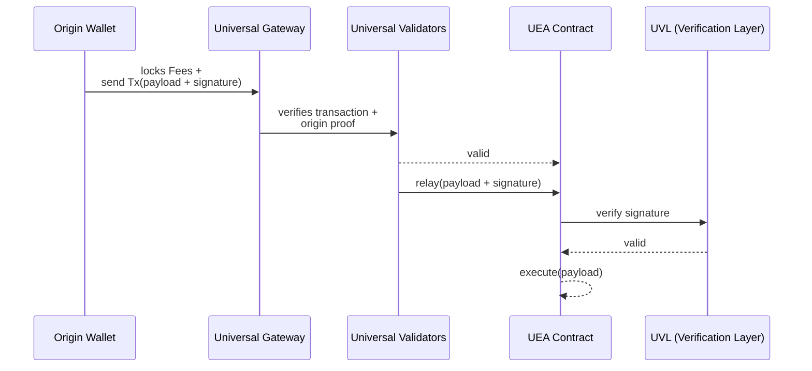

<head>
  <title>How Universal Executor Account (UEA) Works | Deep Dives | Push Chain Docs</title>
</head>

import Tabs from '@theme/Tabs';
import TabItem from '@theme/TabItem';
import Details from '@theme/Details';

<!-- Content Start -->

The **Universal Executor Account (UEA)** is one of the key innovations behind **Push Chain’s Universal Execution Layer**. A system that lets any user, from *any origin chain*, execute transactions natively on Push Chain.

In this deep dive, we’ll explore:
- 🧠 What a UEA is  
- ⚙️ How transactions execute under the hood  
- 🔗 How it links identity across chains  
- 🧩 How it differs from EOAs and Smart Accounts  

## What Is a Universal Executor Account (UEA)?

A **Universal Executor Account** (UEA) is an *interoperable execution identity* that lives on Push Chain but can be *controlled from any origin chain* (such as Ethereum, Solana, Base, Polygon, etc.).

It acts as your **on-chain agent** on Push Chain:
- It holds balances and maintains on-chain state.  
- It executes transactions, including batched multicalls.  
- It validates cross-chain signatures from other networks.  
- It ensures your **source-chain wallet remains in control**.  
- It supports **universal fee abstraction**, meaning you don’t need $PC to transact.

> Think of the UEA as your universal smart account that can be signed from anywhere.

## The UEA Architecture

At a system level, every UEA transaction flows through **Routing → Verification → Execution**.

| Component | Role | Description |
|------------|------|-------------|
| **Universal Gateway** | Routing | Handles inbound and outbound routing between origin chains and Push Chain. Locks user fees and relays payloads. |
| **Universal Validators** | Verification / Security | Form consensus on the validity of cross-chain transactions before relaying to Push Chain. |
| **Universal Verification Layer (UVL)** | Signature Verification | Verifies signatures from multiple chain types (EVM, Solana, etc.) via pluggable verifiers. |
| **Universal Executor Account (UEA)** | Execution | Executes encoded transactions and manages account state on Push Chain. |

## How It Works

When a user signs and submits a transaction from another chain, Push Chain routes and executes it through five stages:

**1. Routing (Universal Gateway)** 
The Universal Gateway locks the required fee on the origin chain and emits the transaction payload to Push Chain.

**2. Transaction Verification (Universal Validators)** 
Universal Validators form consensus on the validity of the transaction. Once verified, the payload is relayed to the user’s corresponding UEA (deterministically derived from their origin wallet).

**3. Payload Reception (UEA)** 
The UEA receives the payload and signature bundle from the validators, which it passes to the Universal Verification Layer for validation.

**4. Signature Verification (UVL)** 
The UVL verifies the origin signature according to that chain’s ruleset — for example, using ECDSA for EVM chains or Ed25519 for Solana.

**5. Execution (UEA)** 
Upon successful verification, the UEA executes the payload on Push Chain — performing single or multiple contract calls atomically.

This design guarantees that every cross-chain transaction is validated, deterministic, and secure before execution.

### Transaction Routing Optimizations

Not all cross-chain transactions require full routing through the Universal Gateway.
The SDK dynamically detects whether the user’s UEA already holds sufficient fees for execution.

If fees exist on the UEA:
- The transaction bypasses both the Gateway and Validators.
-	It’s sent directly to the UEA for immediate execution.
-	This removes source-chain confirmation latency, giving users a near-instant experience after their first funded transaction.

Subsequent transactions feel instant because the UEA can self-fund execution once fees are already available.

### Fast Mode vs Standard Mode

| Mode | When It Activates | Description |
|------|------------------|-------------|
| Fast Mode | When native asset value ≤ $10 | Relays the transaction to the UEA after a single confirmation on the source chain. Ideal for UX-critical low-value operations. |
| Standard Mode | Default | Waits for multiple block confirmations (based on re-org probability) before relaying to Push Chain for execution. |

## How is the Identity Preserved and Linked?

Each UEA is deterministically linked to the user’s origin wallet address.  
This linkage is achieved by using the origin wallet as the **seed for UEA address generation**.

Whenever a new user performs their first transaction, a UEA is automatically deployed (always gasless) and a **mapping** is created between:
- The origin wallet address, and  
- The derived UEA address on Push Chain.

This mapping is stored on the [UEAFactory contract](/docs/chain/build/contract-helpers/#ueafactory-interface) and can be queried either **on-chain** or through the SDK. This ensures every user’s identity remains consistent across chains, and their UEA always maps back to the same origin wallet.

This deterministic linkage also enables advanced cross-chain use cases such as —
- Tracking activity per chain or per identity,  
- Linking multi-chain accounts for the same user, and  
- Enabling “chain-vs-chain” gameplay or logic.

Examples —
- 🕹 [Ballsy App](https://ballsy.push.org) — demonstrates chain-based PvP logic through deterministic UEAs.  
- 🔁 [Universal Counter Tutorial](/docs/chain/tutorials/basics/tutorial-universal-counter/#live-playground) — showcases UEA persistence across origin chains.

## Comparison — EOAs vs Smart Accounts vs UEAs

| Feature | **EOA** | **Smart Account** | **Universal Executor Account (UEA)** |
|----------|----------|--------------------|--------------------------------------|
| **Scope** | Single chain | Single chain | Multi-chain (universal) |
| **Control** | Private key | Smart contract logic | Origin-chain wallet signature |
| **Execution** | Local to chain | Local to chain | Routed through Gateway + Validators |
| **Atomic Multicall** | ❌ | ✅ | ✅ |
| **Fee Token** | Native gas token | Configurable | Any token / sponsored / external |
| **Bridging Required** | ✅ | ✅ | ❌ |
| **Identity Persistence** | Chain-specific | Chain-specific | Deterministically mapped across chains |
| **Verification** | ECDSA only | Custom or EIP-1271 | Cross-chain via UVL (EVM, Solana, etc.) |

> In short: UEAs extend smart account logic beyond a single ecosystem,  
> combining programmable control with cross-chain identity and atomic execution.

## Why the UEA Matters

The UEA fundamentally redefines what a blockchain account can be:

-	A single **execution identity** across chains.
-	Backed by **universal verification** instead of chain-specific keys.
-	Capable of **multi-call atomic execution**.
-	Compatible with **fee abstraction** and **sponsorship models**.

Together, these properties make Push Chain the first blockchain where external users can **act natively**. Not through bridges or wrapped assets, but through their own universal accounts. 