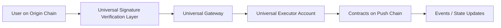

<head>
  <title>How Universal Executor Account (UEA) Works | Deep Dives | Push Chain Docs</title>
</head>

import Tabs from '@theme/Tabs';
import TabItem from '@theme/TabItem';
import Details from '@theme/Details';

<!-- Content Start -->

The **Universal Executor Account (UEA)** is one of the key innovations behind **Push Chain’s Universal Execution Layer** — a system that lets any user, from *any origin chain*, execute smart contract transactions natively on Push Chain.

In this deep dive, we’ll explore:
- 🧠 What a UEA is  
- 🔗 How it links identity across chains  
- ⚙️ How transactions execute under the hood  
- 🧩 How it differs from EOAs and Smart Accounts  

## What Is a Universal Executor Account?

A **Universal Executor Account** (UEA) is an *interoperable execution identity* that exists on Push Chain but can be *controlled from any origin chain* (like Ethereum, Solana, Polygon, etc.).

It acts as your **on-chain agent** on Push Chain:
- It holds funds and state.
- It can execute transactions (even bundles like multicall).
- It validates signatures coming from other chains.
- It supports **universal fee abstraction** — so users don’t need to hold $PC to transact.

> Think of UEA as a *universal smart account* that can be signed from anywhere.

## The UEA Architecture

UEA combines three key components:

| Component | Role | Description |
|------------|------|-------------|
| **Universal Signature Verification Layer (USVL)** | Security | Verifies signatures from multiple chain types (EVM, Solana, etc.). |
| **Universal Gateway** | Routing | Handles inbound/outbound transaction routing between chains. |
| **UEA Contract** | Execution | Executes encoded transactions and maintains account state on Push Chain. |

Each external signature goes through:
	1.	Verification — The USVL verifies the origin chain signature.
	2.	Routing — The Universal Gateway determines the destination UEA.
	3.	Execution — The UEA executes the call(s) as if the origin user directly interacted on Push Chain.